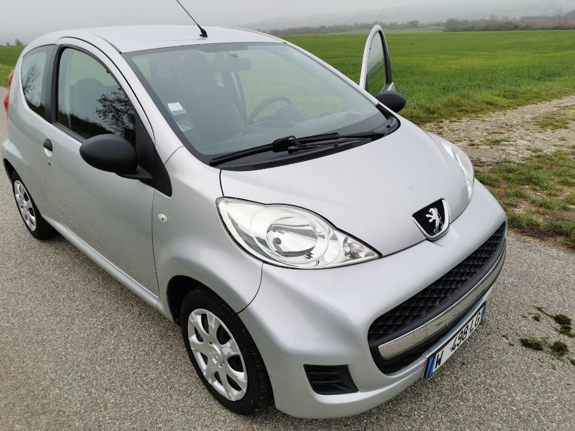
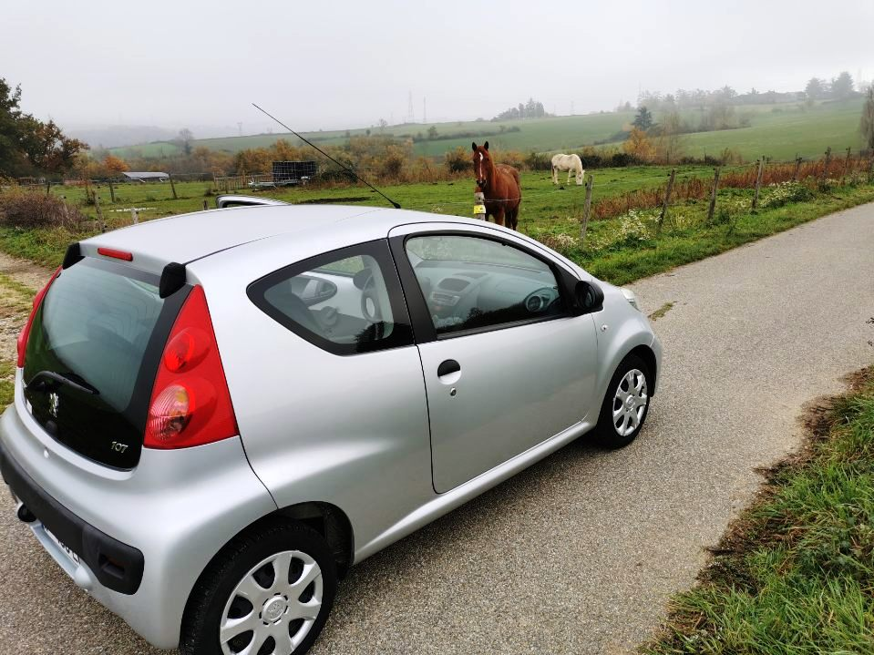
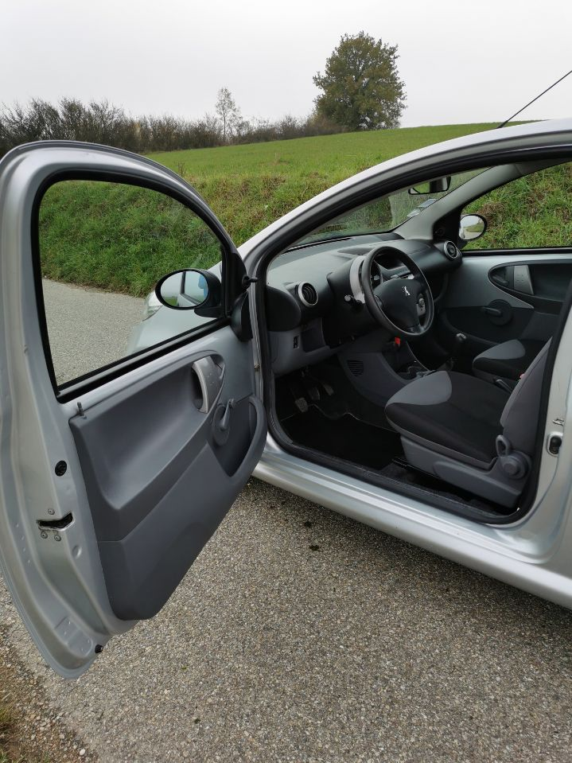

+++
title = "PEUGEOT 107 2010"
description = "PEUGEOT 107 2010 - 86 000 Km"
tags = [
]
date = "2022-06-06"
categories = [
    "Voitures",
]
image = "../post/20221201peugeot107grise/images/1.jpg"
adate = "2010"
akm = "86 000km"
agaz = "essence"
aboite = "manu."
apuissance="68 CV"
acouleur = "grise"

+++

# PEUGEOT 107 2010



PEUGEOT 107 2010 3 portes grise de 2010 totalisant 86.000 km
Puissance fiscale : 4cv
puissance réelle : 68Cv
faibles coûts en assurance et en carburant

Entretien mécanique à jour 
pas de courroie de distribution ( moteur à chaîne)
Carrosserie : propre
CT OK ( moins de 6 mois)
CRITAIR 1
double des clés

disponible rapidement

PRIX : 4900 Euros

<!-- more -->

