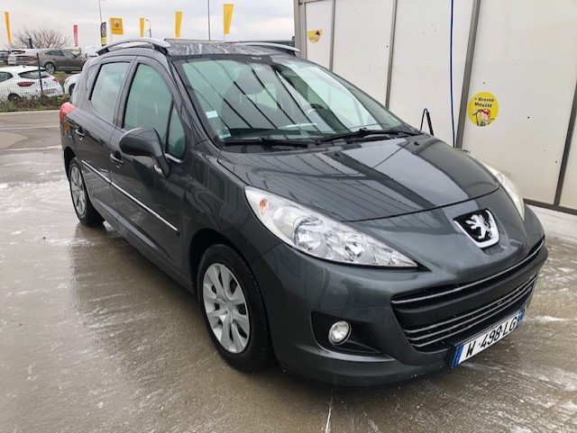
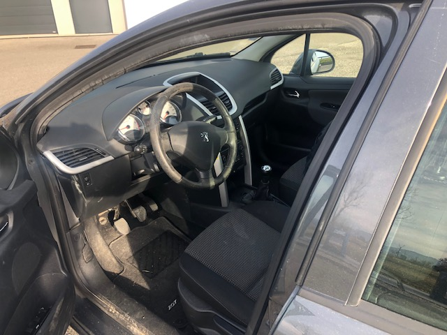
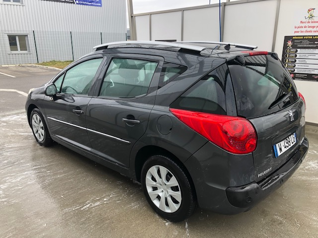

+++
title = "PEUGEOT 207 SW 2011"
description = "PEUGEOT 207 SW 2011 - 130 000 Km"
tags = [
]
date = "2022-06-06"
categories = [
    "Voitures",
]
image = "../post/2022_01_27_peugeot207_bk_154_ks/images/1.jpg"
adate = "2011"
akm = "130 000km"
agaz = "diesel"
aboite = "manu."
apuissance="92 CV"
acouleur = "grise"

+++

# PEUGEOT 207 SW 2011



Couleur gris antracite,  année 2011, 130.000km, 90 CV, puissance 5 CV, carte grise moitié prix (plus de 10 ans),
boite de vitesse mécanique, airbags, jantes alu, climatisation, vitres électriques, direction assistée,
autoradio CD, ….

Entretien mécanique à jour. distribution faite.

Carrosserie  TBEG

Aucun frais à prévoir. 
Contrôle technique OK 

<!-- more -->

