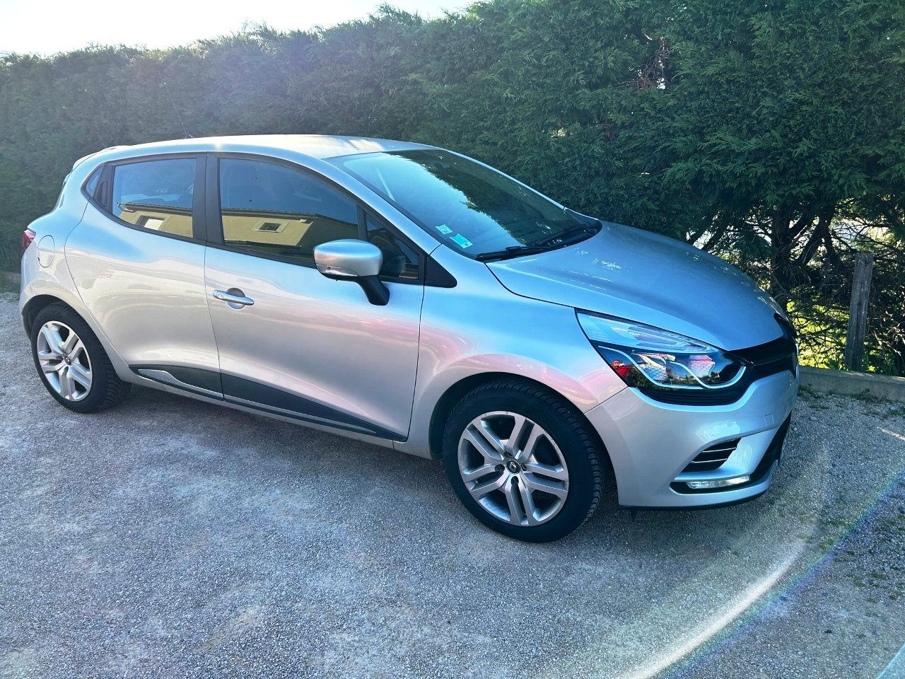
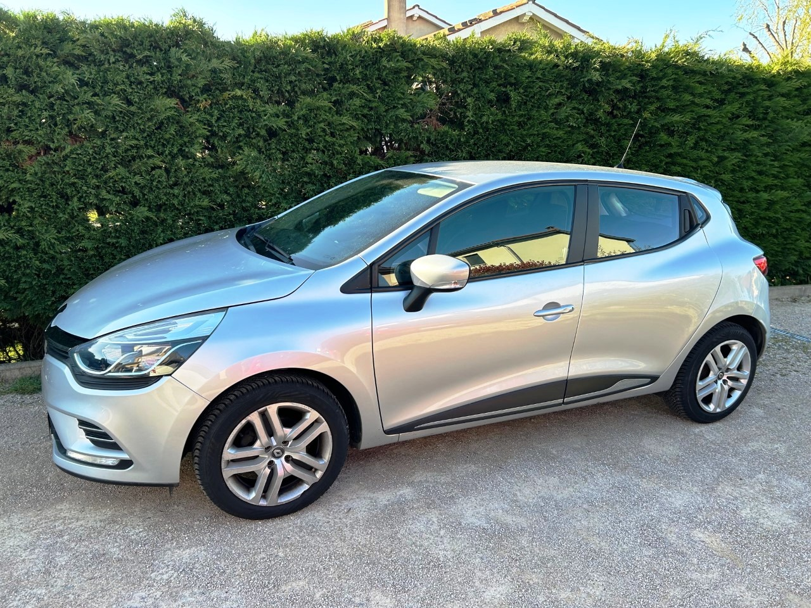
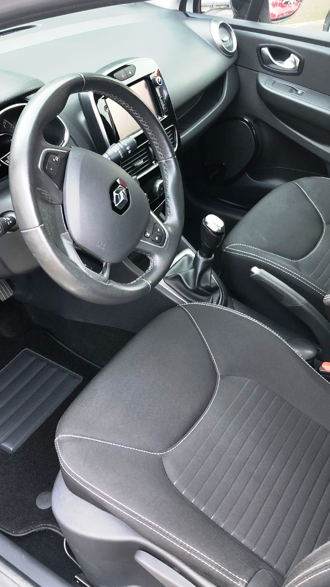

+++
title = "RENAULT CLIO IV grise ZEN 90cv 0.9TCE"
description = "RENAULT CLIO IV grise ZEN 90cv 0.9TCE"
tags = [
]
date = "2022-06-06"
categories = [
    "Voitures",
]
image = "../post/2022_05_18_renault_clio_grise_es098ls/images/1.jpg"
adate = "2017"
akm = " 95000km"
agaz = "essence"
aboite = "manu."
apuissance="90 CV"
acouleur = "grise"
prix="10700"

+++

# RENAULT CLIO IV grise ZEN 90cv 0.9TCE



RENAULT CLIO IV grise ZEN 90cv 0.9TCE de 12/2017 affichant 94.000km
5 portes

Equipements :

AUDIO - TÉLÉCOMMUNICATIONS
Commandes du système audio au volant
Ecran tactile
Fonction MP3
Kit mains-libres Bluetooth
Prise auxiliaire de connexion audio
Prise Jack
Prise USB
Radio

CONDUITE
Aide au démarrage en côte
Commande Mode ECO
Démarrage sans clé
Limiteur de vitesse
Régulateur de vitesse

COULEUR
grise 
Sellerie Tissu Noir/Gris style carbone

EXTÉRIEUR
Becquet arrière
Boucliers AV et AR couleur caisse
Enjoliveurs
Essuie-glace arrière
Feux de freinage d'urgence
Feux de jour à LED
Phares halogènes
Répétiteurs de clignotant dans rétro ext
Rétroviseurs dégivrants
Rétroviseurs électriques

INTÉRIEUR
Bacs de portes avant
Banquette AR rabattable
Banquette arrière 3 places
Banquette 1/3-2/3
Boite à gant fermée
Clim manuelle
Compte tours
Ecran multifonction couleur
Lampe de coffre
Lunette AR dégivrante
Miroir de courtoisie passager
Ordinateur de bord
Prise 12V
Siège conducteur réglable en hauteur
Tablette cache bagages
Température extérieure
Verrouillage auto. des portes en roulant
Verrouillage centralisé à distance
Vitres avant électriques
Volant cuir
Volant réglable en profondeur et hauteur

SÉCURITÉ
ABS
Aide au freinage d'urgence
Airbag conducteur
Airbag passager déconnectable
Airbags latéraux avant
Antidémarrage électronique
Antipatinage
Ceintures avant ajustables en hauteur
Détecteur de sous-gonflage indirect
EBD
ESP
Préparation Isofix
Troisième ceinture de sécurité

Descriptif Renault sous reserve d'erreur

ENTRETIEN
entretien à jour avec factures ( dernier entretien 12/2022)
carrosserie : propre

2 clés
Pas de courroie de distribution ( moteur à chaîne)

disponible de suite

PRIX : 10700 Euros

<!-- more -->

