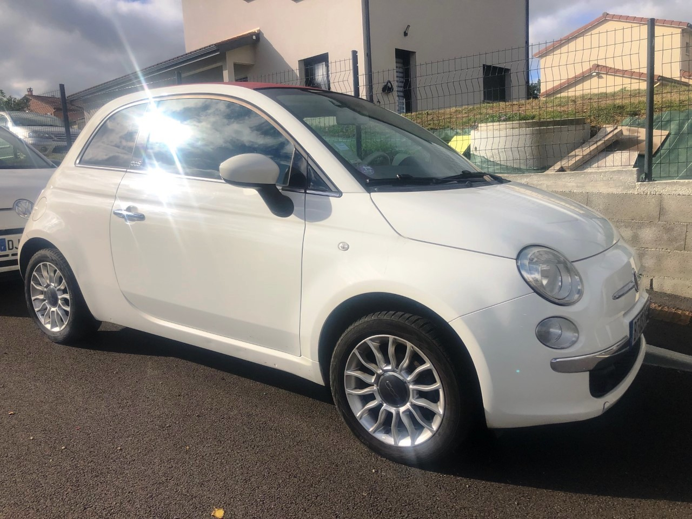
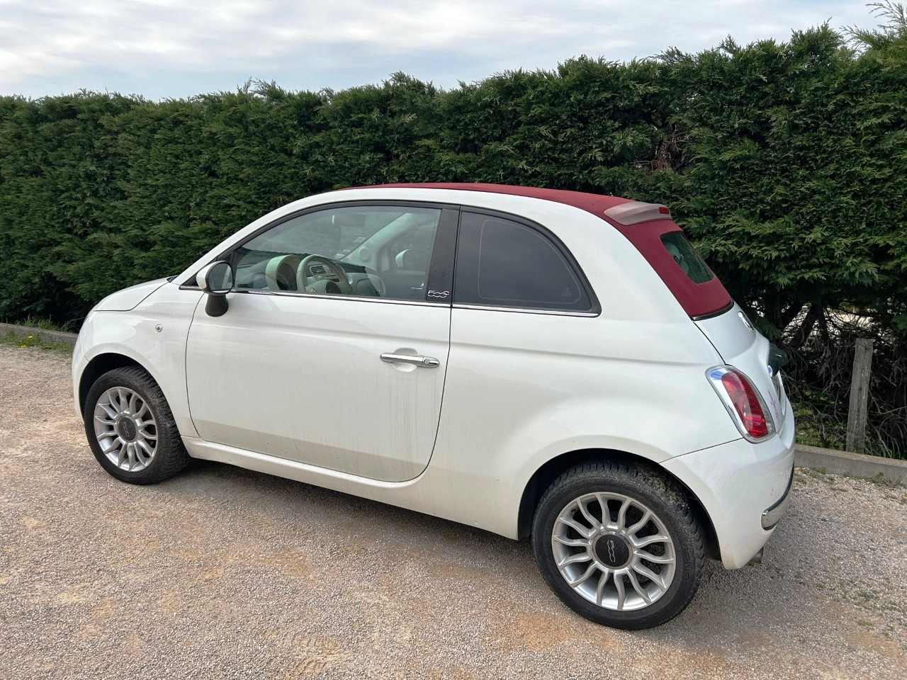
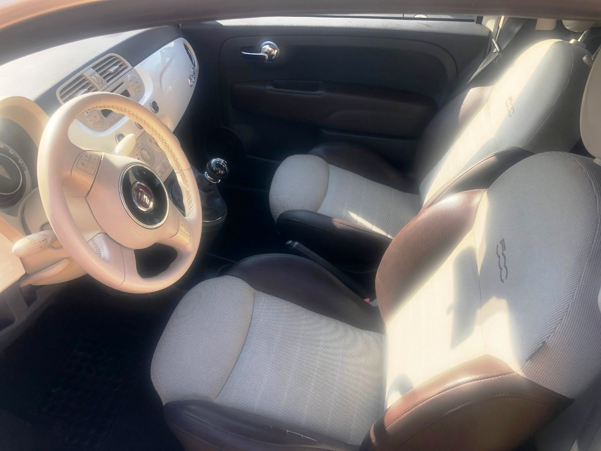

+++
title = "FIAT 500 cabriolet 2011 "
description = "FIAT 500 cabriolet 2011"
tags = [
]
date = "2022-06-06"
categories = [
    "Voitures",
]
image = "../post/2022_06_30_fiat500beige_capoterouge_bt031kw/images/1.jpg"
adate = "2011"
akm = "158 000km"
agaz = "essence"
aboite = "manuelle"
apuissance="68 CV"
acouleur = "beige"
prix="6400"
+++

# FIAT 500 cabriolet 2011



FIAT 500 Cabriolet 1.2 8V 69 CH S&S LOUNGE

FIAT 500C de 2011, beige avec capote bordeaux, totalisant 158000km

### EQUIPEMENTS :
Climatisation manuelle, direction assistée, mode city, verrouillage centralisé avec télécommande,
autoradio bluetooth, vitres électrique, capote électrique, sièges isofix, double des clés,
radars de recul arrière, etc
Merci de vérifier cette liste d'équipements avec un commercial

### CARROSSERIE
Très propre

###  INTERIEUR :
interieur tissus/ cuir

### MECANIQUE :
Entretien courant fait ( vidange+filtres), courroie de distribution remplacée ,
pompe à eau neuve, courroie accessoire neuve, amortisseurs avants neufs...
Contôle technique : OK 

Disponible rapidement

### PRIX : 6400 Euros

<!-- more -->

