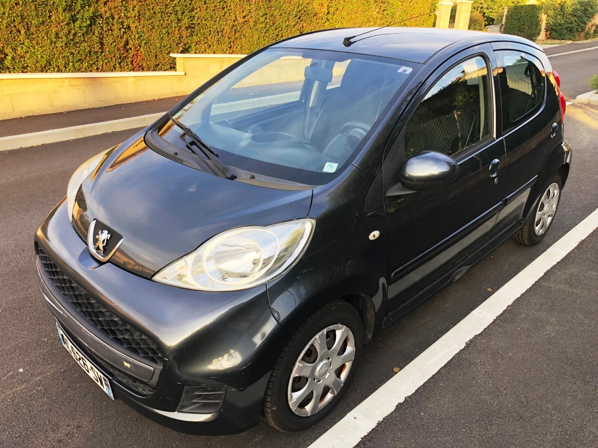
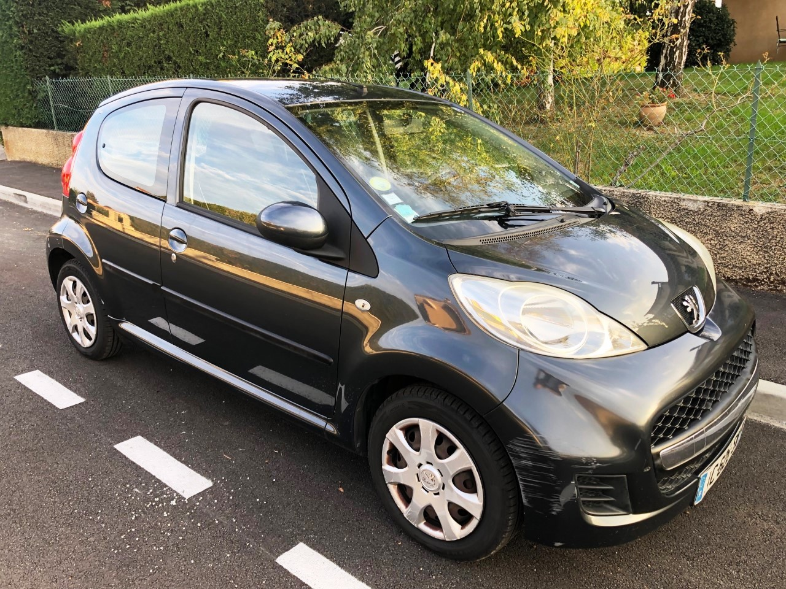
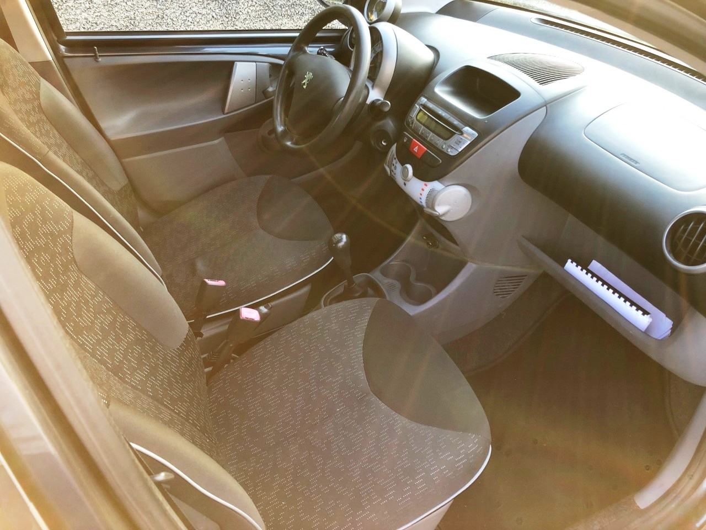

+++
title = "PEUGEOT 107 Essence 5 portes"
description = "PEUGEOT 107 Essence 2009 128.000km"
tags = [
]
date = "2022-06-06"
categories = [
    "Voitures",
]
image = "../post/2022_08_30_peugeot107noire_ac626sw/images/1.jpg"
adate = "2009"
akm = "128 000km"
agaz = "essence"
aboite = "manu."
apuissance="68 CV"
acouleur = "noire"

+++

# PEUGEOT 107 Essence 5p



PEUGEOT 107 1.0L 68cv finition Trendy 5 portes de 2009 totalisant 127.000 km

Options : vitres électriques, verrouillage centralisé avec télécommande, double des clés, direction assistée, pas de clim, intérieur tissu, tapis de sol neufs, autoradio, etc

Mécanique : à jour ( dernier entretien 05/2022) . nombreuses factures dispo
Moteur à chaîne de distribution ( donc pas de courroie à prévoir)
Embrayage d'origine ( fonctionne très bien)
Freins neufs à l'avant ( disques + plaquettes)
4 pneus neufs
...
CT OK ( moins de 6 mois)
Carrosserie : léger enfoncement bas de caisse cote conducteur et qq rayures et griffures de ville
Véhicule idéal pour jeune conducteur ( -trice)
carte grise moitié prix
Consommation mixte 4,3L/ 100km

disponible rapidement

PRIX : 4200 Euros

<!-- more -->

