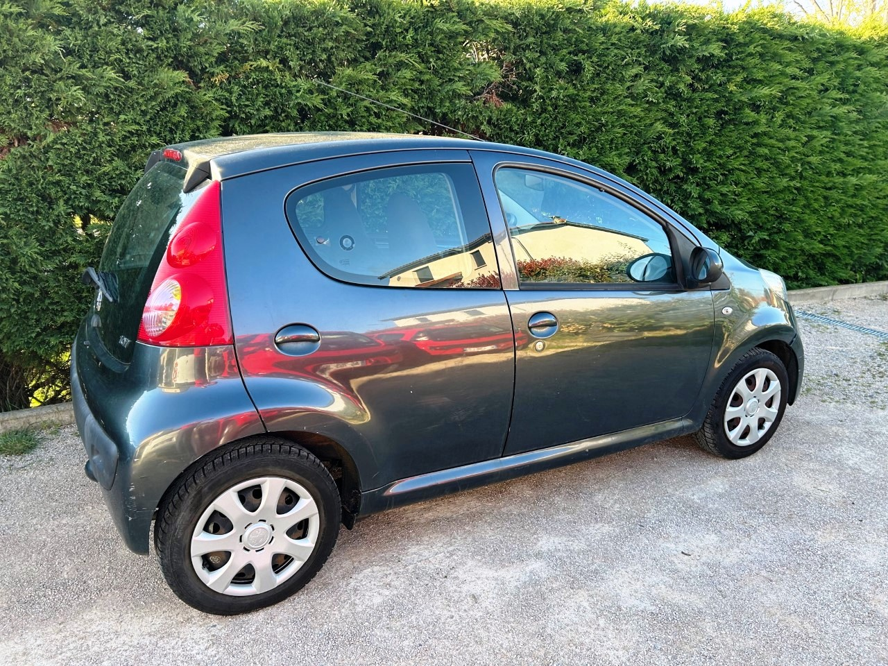
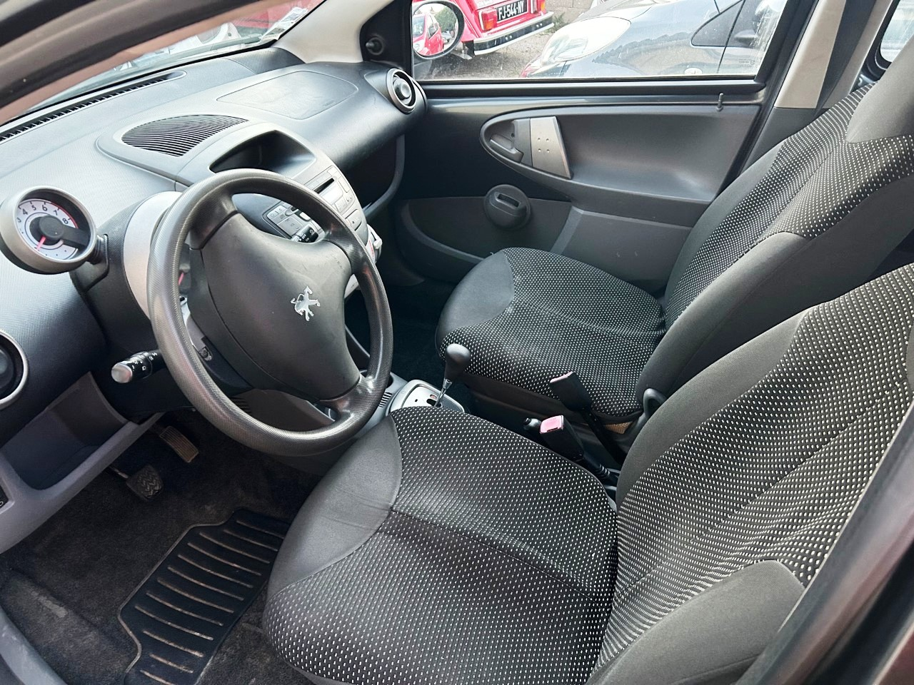

+++
title = "PEUGEOT 107 grise BVA 2006"
description = "107- Année 2006 - 108 000 Km"
tags = [
]
date = "2023-03-27
categories = [
    "Voitures",
]
image = "../post/20230404_peugeot_107_grisfonce_5pbva/images/1.jpg"
adate = "2006"
akm = "108 000km"
agaz = "essence"
aboite = "automatique"
apuissance="68 CV"
acouleur = "gris foncé"
prix="6300"

+++

# PEUGEOT 107 grise BVA 2006



107- Année 2006 - 108 000 Km BVA 5 portes grise de 2006 totalisant 108 000 km

### EQUIPEMENTS :
Vérrouillage centralisé, Direction assistée,compte tours, sièges isofix, poste radio bluetooth, vitres avant electriques, roue de secours, etc..
Merci de valider cette liste d'équipements avec un commercial

### CARROSSERIE :
Propre ( voir photos)

### INTERIEUR :
Tissus noir/gris propre

### MECANIQUE :
Entretien mécanique à jour 
Derniere vidange 03/2023 ( huile moteur + filtres+ bougies)
Pas de courroie de distribution (moteur à chaîne)

Controle technique OK ( moins de 6 mois)

CRITAIR 1

Double des clés

Disponible rapidement

### PRIX 6300 Euros

<!-- more -->

