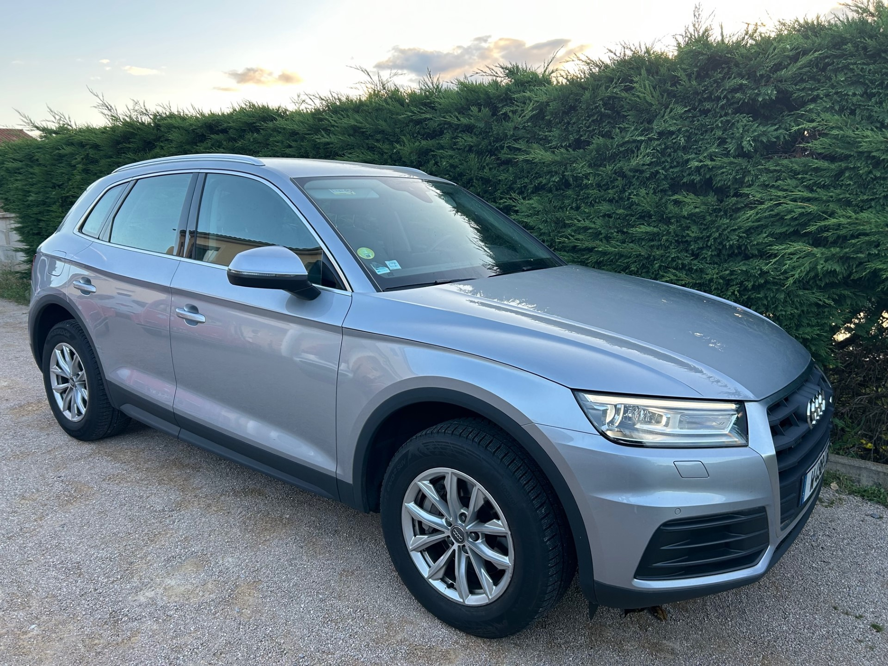
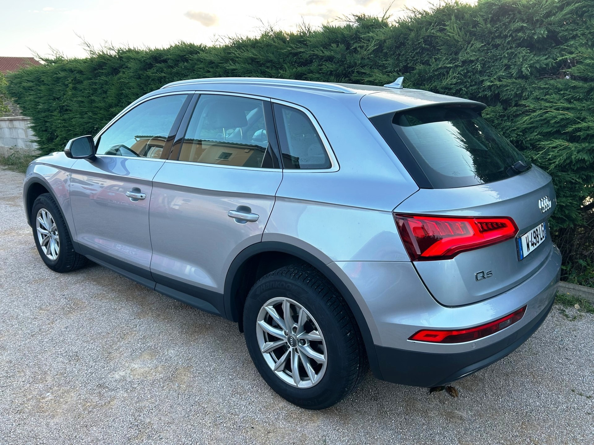
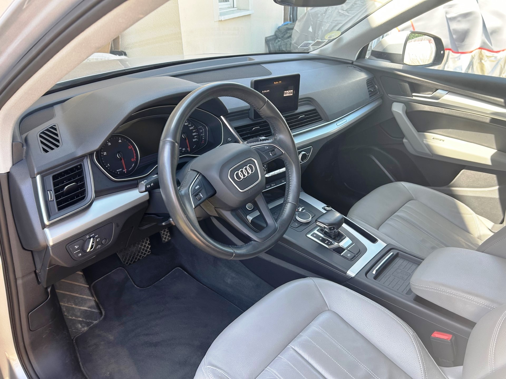

+++
title = "AUDI Q5 gris 190CV QUATTRO"
description = "AUDI Q5 gris 190CV QUATTRO"
tags = [
]
date = "2023-07-30"
categories = [
    "Voitures",
]
image = "../post/20230730_audiq5gris2017/images/1.jpg"
adate = "2017"
akm = "130 000km"
agaz = "diesel"
aboite = "auto"
apuissance= "190 CV"
acouleur = "gris"
prix="26600"

+++

# AUDI Q5



AUDI Q5 2L TDI 190CV QUATTRO PACK Business Executive gris fleuret metallisé de 11/2017 affichant 130000km

Véhicule première main

### EQUIPEMENTS :

Argent Fleuret
8 Haut parleurs
ABS
Accoudoir central AV
Aide au freinage d'urgence
Airbag conducteur
Airbag passager déconnectable
Airbags latéraux avant
Airbags rideaux AV et AR
Antidémarrage électronique
Antipatinage
Appui-tête conducteur réglable hauteur
Appui-tête passager réglable en hauteur
Arrêt et redémarrage auto. du moteur
Bacs de portes arrière
Bacs de portes avant
Banquette 40/20/40
Banquette AR rabattable
Banquette arrière 3 places
Barres de toit
Blocage électronique du différentiel
Boite à gants éclairée et réfrigérable
Borne Wi-Fi
Boucliers AV et AR couleur caisse
Buses de lave-glace chauffantes
Capteur de luminosité
Capteur de pluie
Ceinture de vitrage chromée
Ceintures avant ajustables en hauteur
Clim automatique tri-zones
Coffre assisté électriquement
Commande Climatisation AR
Commandes du système audio au volant
Commandes vocales
Compte tours
Contrôle élect. de la pression des pneus
Démarrage sans clé
Disque dur multimédia EBD
Echappement à double sortie
Ecran multifonction couleur
ESP
Essuie-glace arrière
Feux arrière à LED
Feux de jour à LED
Filets de coffre
Filtre à particules
Filtre à Pollen
Fixation Isofix siège passager avant
Fixations Isofix aux places arrières
Freinage automatique d'urgence
GPS Cartographique
Interface Media
Jantes Alu
Kit Fumeur
Kit mains-libres Bluetooth
Lampe de coffre
Lampes de lecture à l'avant
Lecteur carte SD
Lecteur CD
Limiteur de vitesse
Lunette AR dégivrante
Miroir de courtoisie conducteur
Miroir de courtoisie passager
Mode de conduite
Ordinateur de bord
Ouverture des vitres séquentielle
Palettes changement vitesses au volant
Phares xénon
Poches d'aumonières
Poignées ton carrosserie
Porte-gobelets arrière
Porte-gobelets avant
Prise 12V
Prise auxiliaire de connexion audio
Prise USB
Radar de stationnement AR
Radar de stationnement AV
Radio
Régulateur de vitesse
Répétiteurs de clignotant dans rétro ext
Rétroviseur intérieur électrochrome
Rétroviseurs dégivrants
Rétroviseurs électriques,
Rétroviseurs rabattables électriquement
Services connectés
Siège conducteur avec réglage lombaire
Siège conducteur réglable en hauteur
Siège passager avec réglage lombaire
Siège passager réglable en hauteur
Sortie d'échappement chromée
Système d'accès sans clé
Tablette cache bagages
Témoin de bouclage des ceintures AV
Température extérieure
TMC
Troisième ceinture de sécurité
Verrouillage centralisé à distance
Verrouillage centralisé des portes
Vitres arrière électriques
Vitres avant électriques
Volant cuir
Volant multifonction

Liste d'options à valider avec un commercial lors de votre visite...

### CARROSSERIE :
En très bon état 
Petite erraflure sur porte ARD

### INTERIEUR :
Cuir gris très propre

### MECANIQUE :
Entretien complet AUDI depuis le début
Vidanges de Boîte faites à 60mkm et 120mkm

Controle technique : OK
rien à prévoir

Voiture disponible rapidement

### PRIX : 26600 Euros

<!-- more -->

