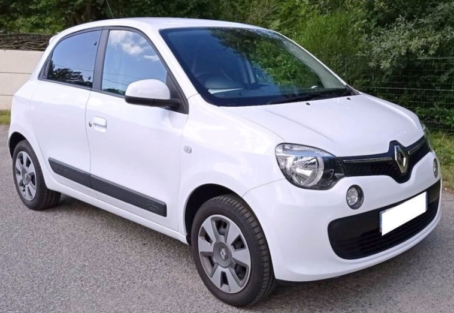

+++
title = "RENAULT TWINGO 3 TCE 90"
description = "RENAULT TWINGO 3 TCE 90"
tags = [
]
date = "2023-08-17"
categories = [
    "Voitures",
]
image = "../post/20230817_renaulttwingo3blanchetce/images/1.jpg"
adate = "2017"
akm = "37 000km"
agaz = "Essence"
aboite = "manu"
apuissance= "90 CV"
acouleur = "blanc"
prix="8500"

+++

# RENAULT TWINGO 3 TCE 90



RENAULT TWINGO 3 0.9L TCE 90CV ZEN de 2017 affichant 37000km

AUDIO - TÉLÉCOMMUNICATIONS
2 Haut parleurs
Commandes du système audio au volant
Kit mains-libres Bluetooth
Prise Jack
Prise USB
Radio

CONDUITE
Aide au démarrage en côte
Arrêt et redémarrage auto. du moteur
Limiteur de vitesse

COULEUR
Blanc Cristal
intérieur Tissu Noir / Gris

EXTÉRIEUR
Becquet arrière
Feux de freinage d'urgence
Feux de jour à LED
Hayon arrière
Poignées ton carrosserie

INTÉRIEUR
Bacs de portes avant
Banquette 50/50
Banquette AR rabattable
Boite à gant fermée
Clim manuelle
Direction assistée
Direction à assistance variable
Fixations Isofix aux places arrières
Miroir de courtoisie conducteur
Miroir de courtoisie passager
Ordinateur de bord
Prise 12V
Tablette cache bagages
Verrouillage auto. des portes en roulant
Verrouillage centralisé à distance
Vitres avant électriques
Vitres teintées
Volant réglable en hauteur

SÉCURITÉ
ABS
Aide au freinage d'urgence
Airbag conducteur
Airbag passager
Airbag passager déconnectable
Airbags latéraux avant
Antidémarrage électronique
Détecteur de sous-gonflage
ESP
Préparation Isofix
Témoin de bouclage ceinture conducteur
Témoin de bouclage des ceintures AV

Liste d'options à valider avec un commercial lors de votre visite

Voiture disponible rapidement

### PRIX : 8500 Euros

<!-- more -->

