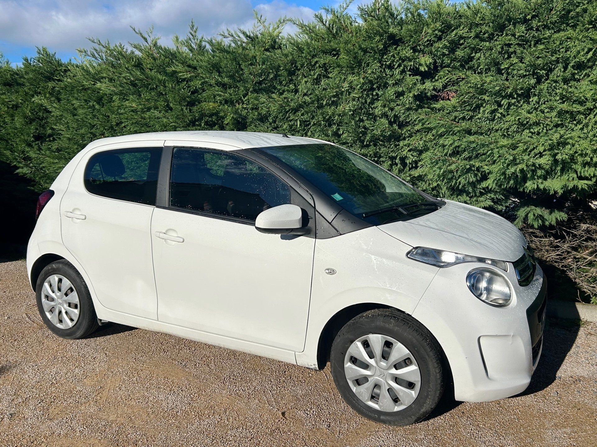
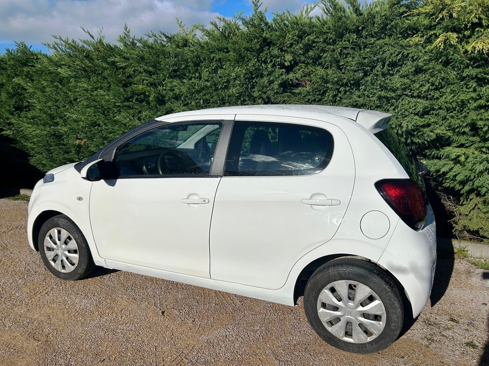
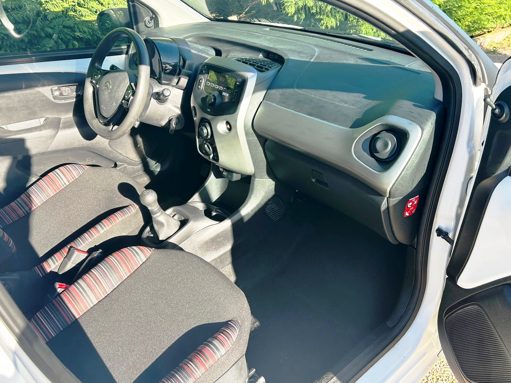

+++
title = "CITROEN C1 II 1.0L VTI 69CV 5 portes clim "
description = "CITROEN C1 II 1.0L VTI 69CV 5 portes clim"
tags = [
]
date = "2023-09-08"
categories = [
    "Voitures",
]
image = "../post/20230907_c1blanche5p2016/images/1.jpg"
adate = "2016"
akm = "48 000km"
agaz = "essence"
aboite = "manuelle"
apuissance= "69 CV"
acouleur = "blanche"
prix="8300"

+++

# CITROEN C1



CITROEN C1 II Blanche VTI 1.0L 69cv FEEL 5 portes de 2016 affichant 48.000 km 

### EQUIPEMENTS :
Verrouillage centralisé avec télécommande, Vitres électriques avant, Poste radio USB bluetooth, Climatisation manuelle, Surveillance de la pression des pneus, Limiteur de vitesse, aide au démarrage en côte, ABS, Airbags, Sièges arrières ISOFIX, roue de secours etc.. 
Liste d’options à valider avec moi lors de votre visite…

### CARROSSERIE :
impeccable 

### INTERIEUR :
Tissu noir carreaux très bon état

### MECANIQUE :
Entretien à jour (dernier entretien 05/2023).
Historique avec factures
Rien à prévoir

Véhicule prêt à partir
garantie

mot clé : idem peugeot 108, renault clio, twingo, fiat 500, fiat panda, chevrolet spark, VW fox, toyota aygo, smart fortwo,nissan pixo, kia picanto, etc etc

### PRIX : 8300 Euros

<!-- more -->

