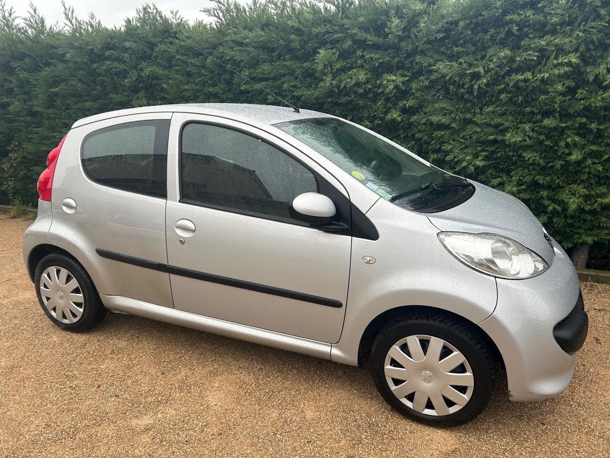
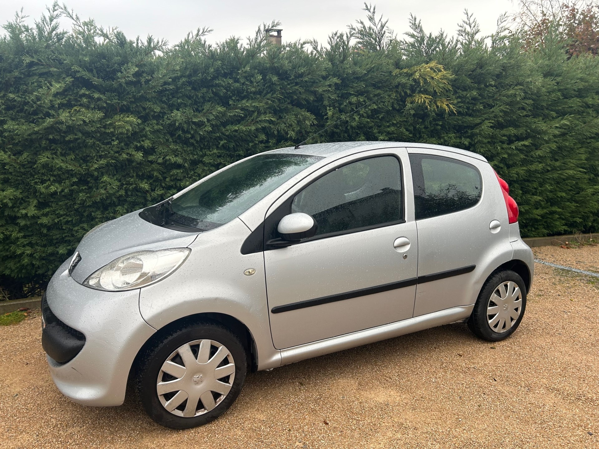
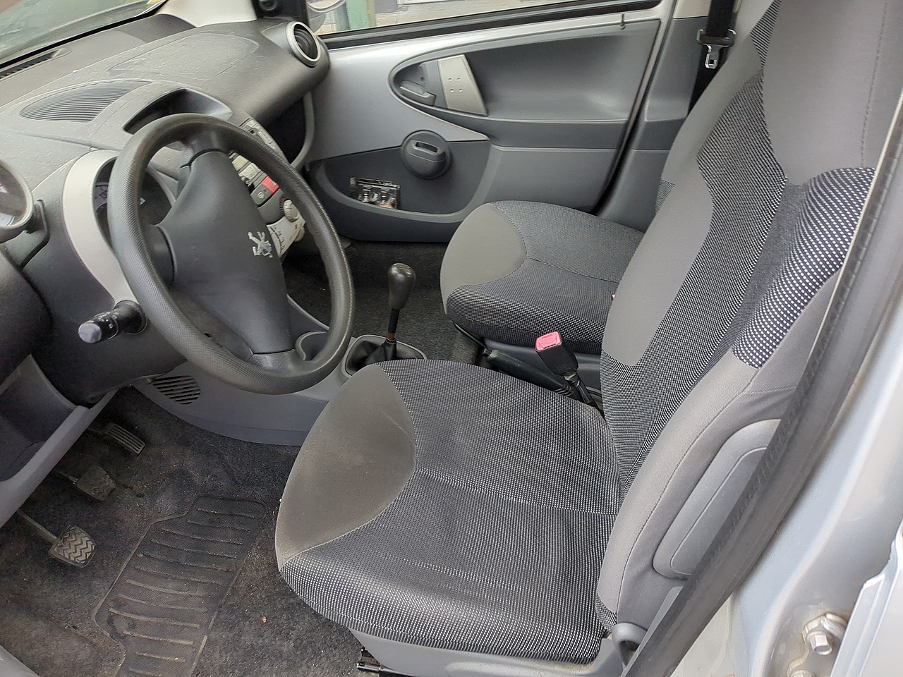

+++
title = "PEUGEOT 107 TRENDY 5p clim 2007"
description = "PEUGEOT 107 TRENDY 5p clim 2007"
tags = [
]
date = "2023-11-22"
categories = [
    "Voitures",
]
image = "../post/20231022_107griseclair5ptrendyclim/images/1.jpg"
adate = "2007"
akm = "110 000km"
agaz = "essence"
aboite = "manuelle"
apuissance= "69 CV"
acouleur = "grise"
prix="4500"

+++

# PEUGEOT 107 TRENDY



PEUGEOT 107  TRENDY grise 69cv 5 portes de 2007 affichant 110.000 km

### EQUIPEMENTS :
Verrouillage centralisé avec télécommande, Climatisation manuelle, Compte tours, Direction assistée , Radio CD auxi ( possibilité de poste bluetooth), Vitres avant électriques, Airbags, ABS, Sièges arrières ISOFIX, Sièges arrières rabattables, Véritable roue de secours..etc.
Liste d'options à valider avec moi lors de l'achat

### CARROSSERIE :
Propre 

### INTERIEUR :
Tissu noir , nettoyé par professionnel

### MECANIQUE :
Entretien à jour ( vidange+filtres)
Moteur à chaine de distribution (pas de courroie à remplacer)
Embrayage neuf
Factures d'entretien

Controle technique : OK
rien à prévoir

Voiture prêt à partir

### PRIX : 4500 Euros

<!-- more -->

