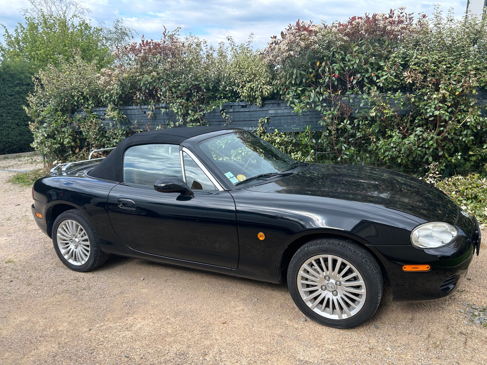
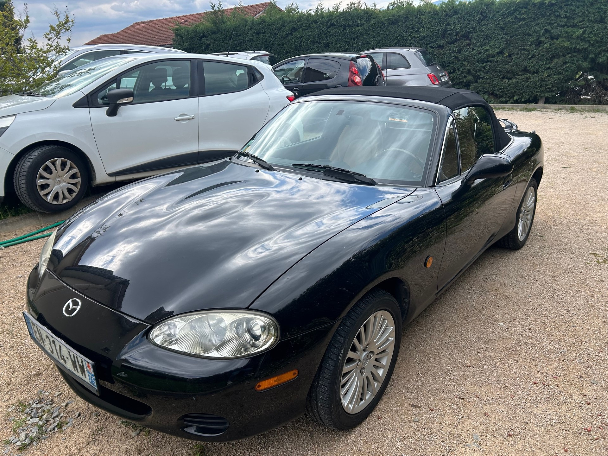
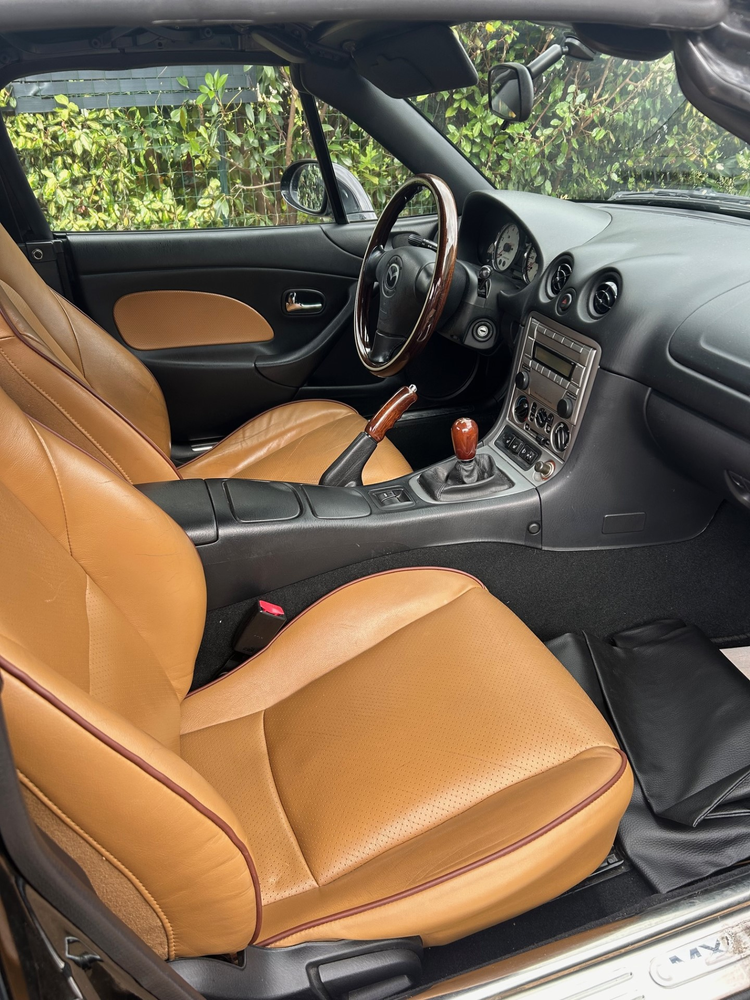

+++
title = "MAZDA MX5 noire 2005 NBFL IMPULS "
description = "MAZDA MX5 noire 2005 NBFL IMPULS   "
tags = [
]
date = "2024-05-06"
categories = [
    "Voitures",
]
image = "../post/20240510_mazda_mx5noire_2005_90mkm/images/1.jpg"
adate = "2005"
akm = "90 000km"
agaz = "essence"
aboite = "manuelle"
apuissance= "146 CV"
acouleur = "noire"
prix="13500"

+++

# MAZDA MX5 noire 2005 NBFL IMPULS 


 

 MAZDA MX-5 1.8L 146cv de 09/2005 affichant seulement 90.000km
Série limitée IMPULS produite à 500 exemplaires ( en version 1.8L)

### EQUIPEMENTS :
Noir brillant,
Jantes en alliage 15" à 20 branches avec pneus 195/50
Encadrement chromé des déflecteurs de portes,
Porte-bagages sur coffre,
Rétroviseurs à réglages électriques,

### CARROSSERIE :
Sort de carrosserie avec reprise des bas de caisse et traitement anti-corrosion
Carrosserie en TBE

### INTERIEUR :
Sellerie cuir Havane 
Contreporte avec partie centrale Havane,
Sièges chauffants,
Volant bois Nardi avec insert crème,
Pommeau de levier de vitesses et poignée de frein à main assortis,
Tableau de bord noir,
Compteurs à fond blanc et cerclages chromés,
Système audio CD Sound Bord,
Seuils de portes chromés avec logo "MX-5",
Filet coupe-vent,
Arceaux décoratifs chromés.

Option : climatisation

### MECANIQUE :
Courroie de distribution faite à 75mkm
Entretien suivi avec carnet ( dernier entretien 05/2024)
Véhicule seconde main importé d'Allemagne en 2017

Contrôle technique OK 

Aucun frais à prévoir

### PRIX : 13500 Euros

disponible sur parc bientôt
garantie 

<!-- more -->

