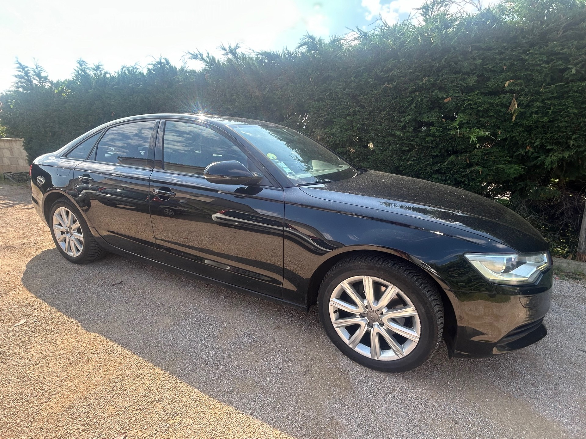
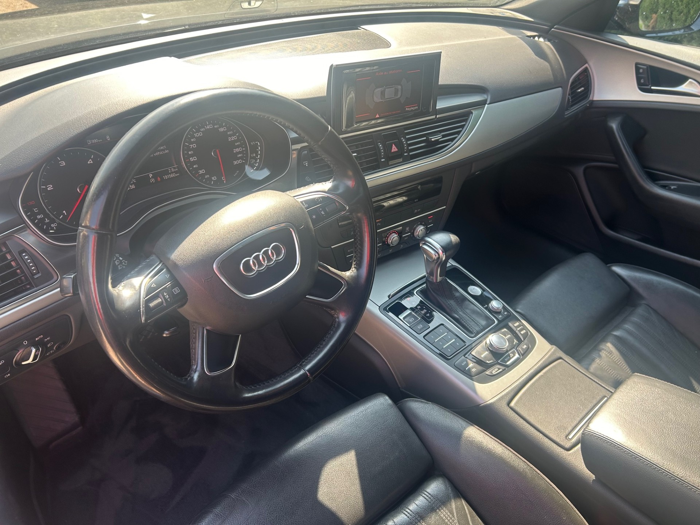

+++
title = "AUDI A6 2L TDI 190CV ULTRA S-TRONIC 7 2014 "
description = "AUDI A6 2L TDI 190CV ULTRA S-TRONIC 7 2014   "
tags = [
]
date = "2024-06-06"
categories = [
    "Voitures",
]
image = "../post/20240607audi_a6_noire_2014_190mkm/images/1.jpg"
adate = "2014"
akm = "191 000km"
agaz = "diesel"
aboite = "auto"
apuissance= "190 CV"
acouleur = "noire"
prix="13900"

+++

# AUDI A6 2L TDI 190CV ULTRA S-TRONIC 7 2014


 

 AUDI A6 2L TDI 190CV ULTRA S-TRONIC 7 de 2014 affichant 191.000km
Finition Ambition Luxe

### EQUIPEMENTS :

Sièges en cuir électriques, toit ouvrant, climatisation bizone, vitres électriques, jantes alu, verrouillage centralisé avec télécommande ( X2), démarrage sans clé, radio MMI avec gps, etc etc
Liste d'options à valider lors de votre visite

### CARROSSERIE :
Carrosserie en TBE ( qq rayures d'usage)

### INTERIEUR :
propre ( cuir entretenu).
Tapis de sol neufs
4 pneus MICHELIN Crossclimate 4 saisons à mi-usure

### MECANIQUE :
entretien à jour (vidanges moteur et boite de vitesse )
distribution récente à jour

CT OK ( fait il y a un an... sera refait pour la vente)
Suite au dernier CT ( 08/23), remplacement des bras de suspension , des rotules et des roulements du train avant

Aucun frais à prévoir

### PRIX : 13900 Euros

Disponible sur parc 

<!-- more -->

