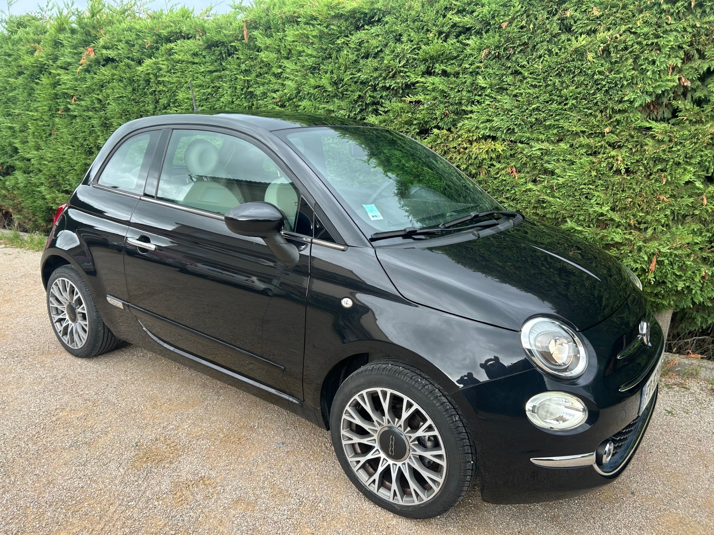
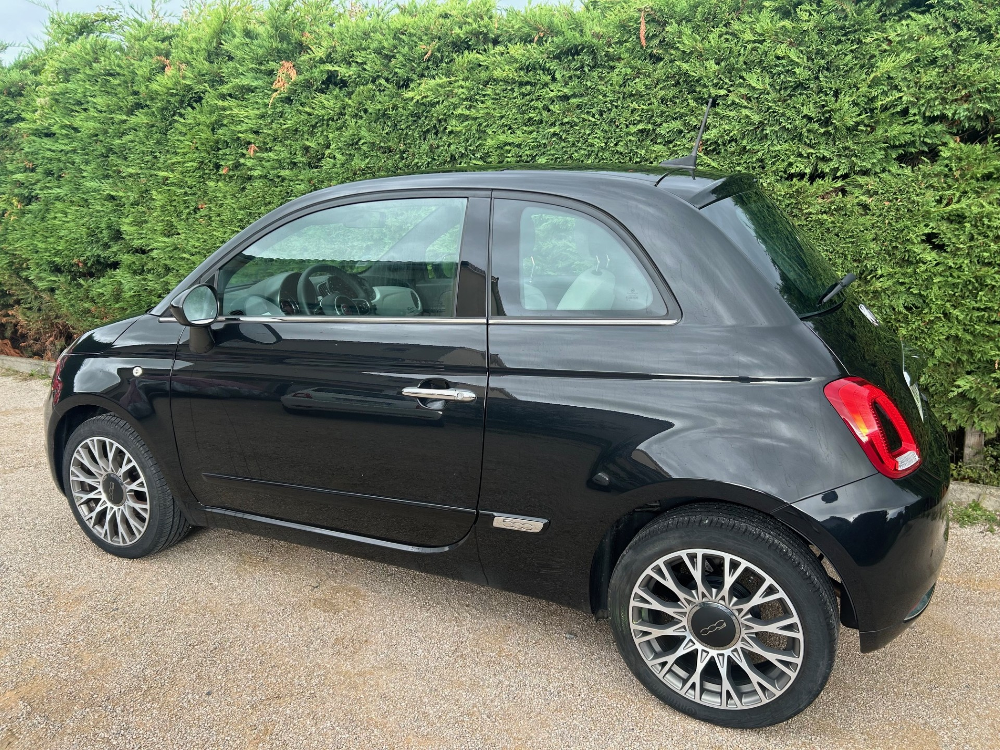
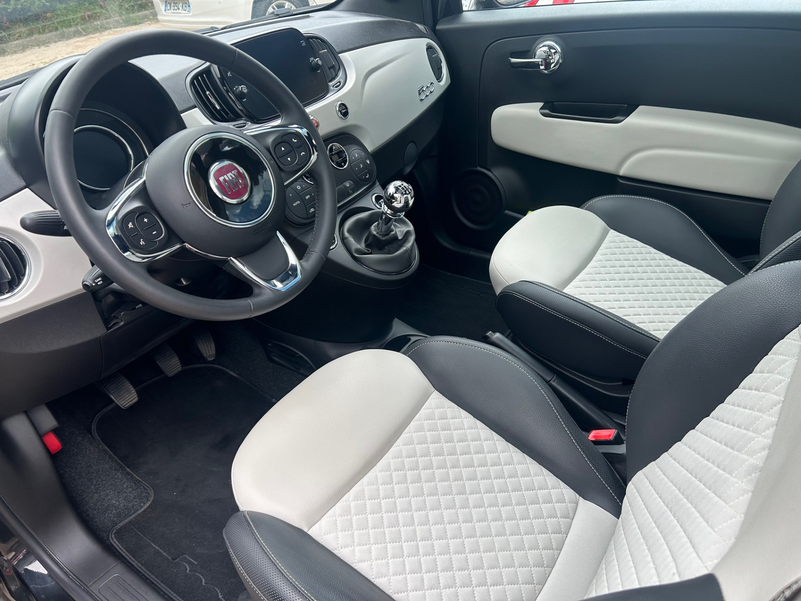

+++
title = "FIAT 500 hybride noire 70CV Essence clim"
description = "FIAT 500 hybride noire 70CV Essence clim"
tags = [
]
date = "2024-09-248
categories = [
    "Voitures",
]
image = "../post/20240929_fiat500_hybride_noire_2020/images/1.jpg"
adate = "2020"
akm = "22.000km"
agaz = "essence hybride"
aboite = "Manuelle"

apuissance= "70 CV"
acouleur = "noire"
prix="11000"

+++

# FIAT 500 hybride noire 70CV Essence clim



FIAT 500 hybride noire 70CV Essence de 2020 affichant 22.000km

### EQUIPEMENTS :
Verrouillage centralisé avec télécommande, vitres électriques, Radio Bluetooth avec écran tactile, climatisation , ABS,ESP, airbags, sièges arrières isofix, banquette arrière rabattable, toit panoramique vitré, radar de recul, boite vitesse manuelle 6 rapports, jantes alu 16 pouces   etc..

Liste d'options à valider avec un commercial lors de votre visite.

### CARROSSERIE :
 Très Bon état 

### INTERIEUR :
Cuir noir bi-ton impeccable

### MECANIQUE :
rien à prévoir
2 pneus neufs à l'avant
batterie neuve

Voiture disponible rapidement

### PRIX : 11000 Euros

<!-- more -->

