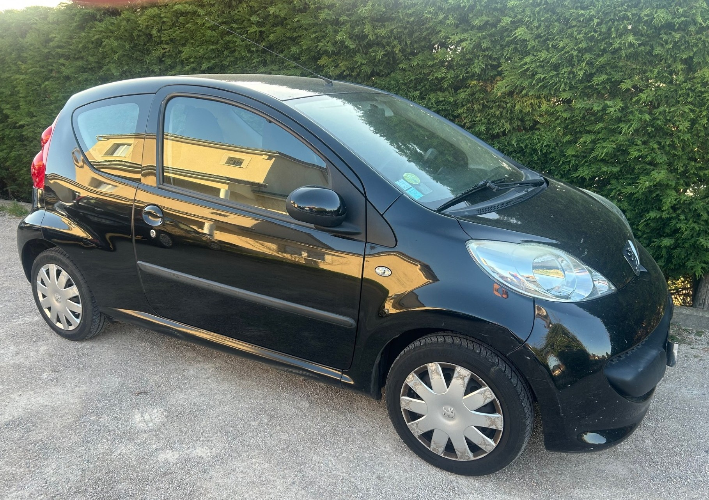
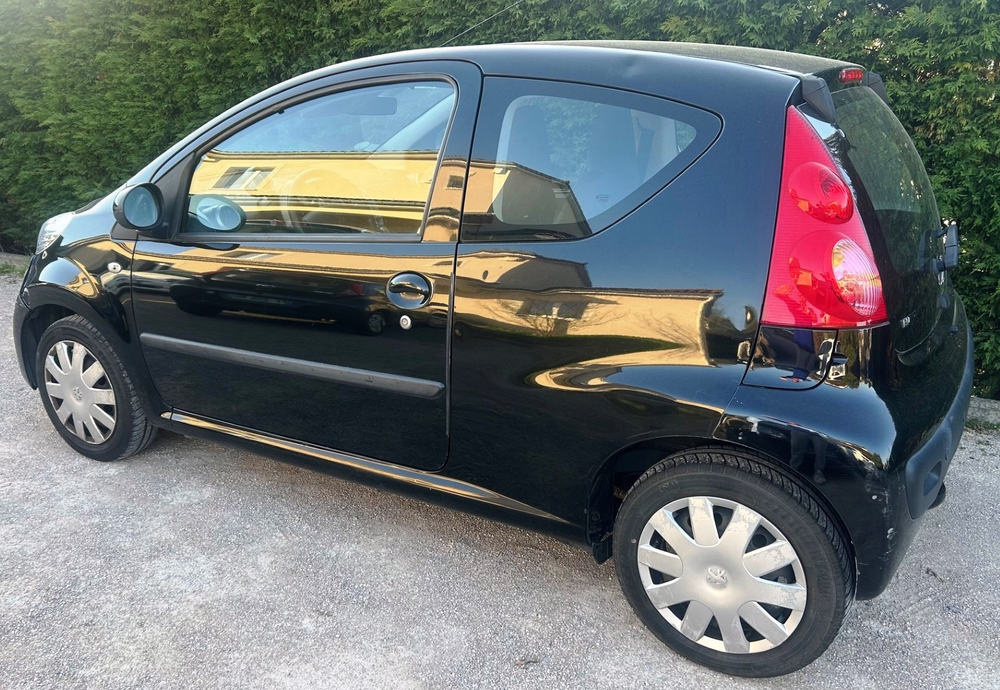
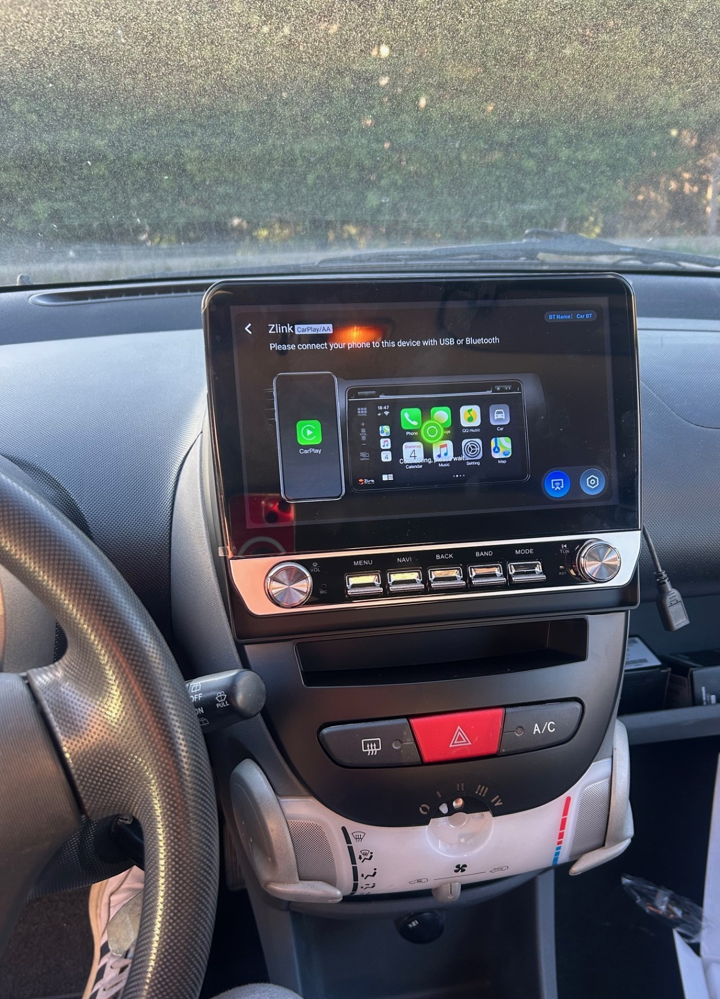

+++
title = "PEUGEOT 107 3p BVA noire Essence critair2"
description = "PEUGEOT 107 3p BVA noire Essence critair2 "
tags = [
]
date = "2025-04-02"
categories = [
    "Voitures"
]
image = "../post/20250402_peugeot_107noire_bva_3p_2008_160mkm/images/1.jpg"
adate = "2008"
akm = "160 000km"
agaz = "essence"
aboite = "auto"
apuissance= "68 CV"
acouleur = "noire"
prix="5900"

+++

# PEUGEOT 107 3p BVA noire Essence critair2


 

PEUGEOT 107 3p BVA noire Essence critair2 affichant 160.000 km 

### EQUIPEMENTS :
Direction assistée ,verrouillage centralisé, compte tours, Radio CD (possibilité de monter un autoradio récent avec écran tactile et fonction CARPLAY), vitres avant électriques, airbags, sièges arrières ISOFIX, banquette arrière rabattable, véritable roue de secours etc.
Liste d'options à valider avec moi lors de votre visite

### CARROSSERIE :
moyenne ( rayures, bosses d'usage)

### INTERIEUR :
Tissu propre

### MECANIQUE :
Entretien à jour ( vidange + filtres faits en 04/2024)
Moteur à chaîne ( pas de Courroie de distribution)

Double des clés
Consommation : 4L/100km
Véhicule économe
Crit air 2
Contrôle technique OK 

Aucun frais à prévoir

### PRIX : 5900 Euros

Disponible rapidement
Garantie

<!-- more -->

