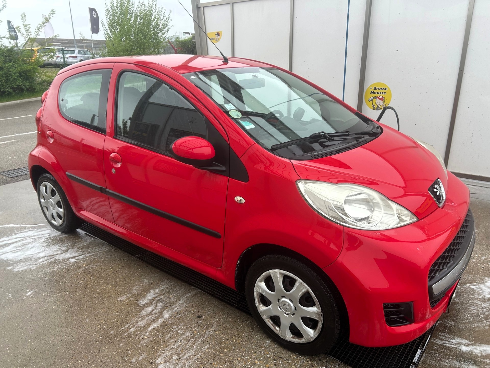
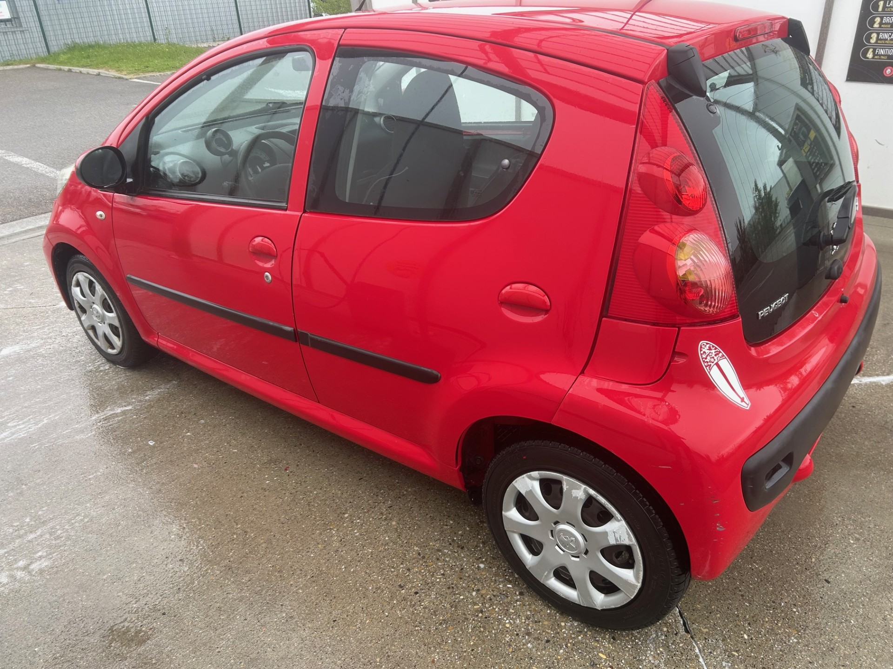
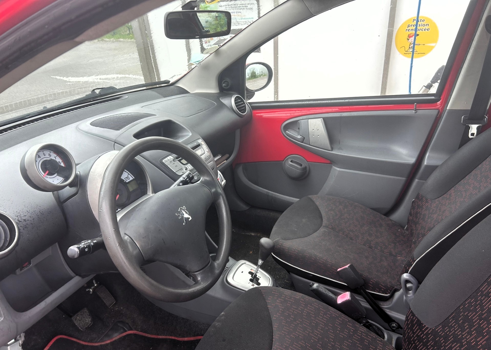

+++
title = "PEUGEOT 107 5p BVA rouge Essence critair2"
description = "PEUGEOT 107 5p BVA rouge Essence critair2 "
tags = [
]
date = "2025-04-23"
categories = [
    "Voitures"
]
image = "../post/20250423_peugeot_107_rouge_bva_5p_2009_145mkm/images/1.jpg"
adate = "2009"
akm = "145 000km"
agaz = "essence"
aboite = "auto"
apuissance= "68 CV"
acouleur = "rouge"
prix="6500"

+++

# PEUGEOT 107 5p BVA rouge Essence critair2


 

PEUGEOT 107 5p BVA rouge Essence critair2 affichant 145.000 km 

### EQUIPEMENTS :
Direction assistée ,verrouillage centralisé, compte tours, Radio CD (possibilité de monter un autoradio récent avec écran tactile et fonction CARPLAY), vitres avant électriques, airbags, sièges arrières ISOFIX, banquette arrière rabattable, véritable roue de secours etc.
Liste d'options à valider avec moi lors de votre visite

### CARROSSERIE :
très propre

### INTERIEUR :
Tissu propre

### MECANIQUE :
Entretien à jour ( vidange + filtres faits en 04/2024)
Moteur à chaîne ( pas de Courroie de distribution)
embrayage neuf

Double des clés
Consommation : 4L/100km
Véhicule économe
Crit air 2
Contrôle technique OK 

Aucun frais à prévoir

### PRIX : 6500 Euros

Disponible rapidement
Garantie

<!-- more -->

