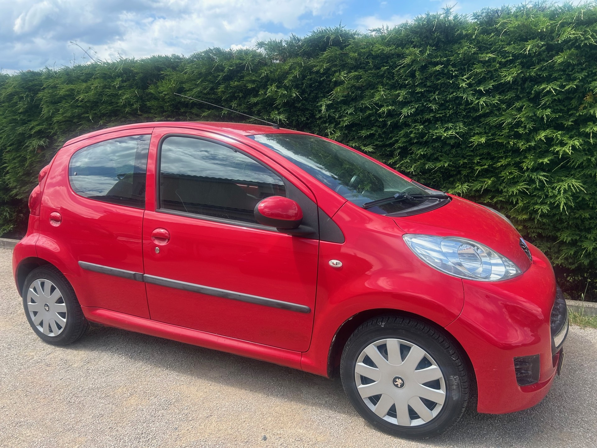
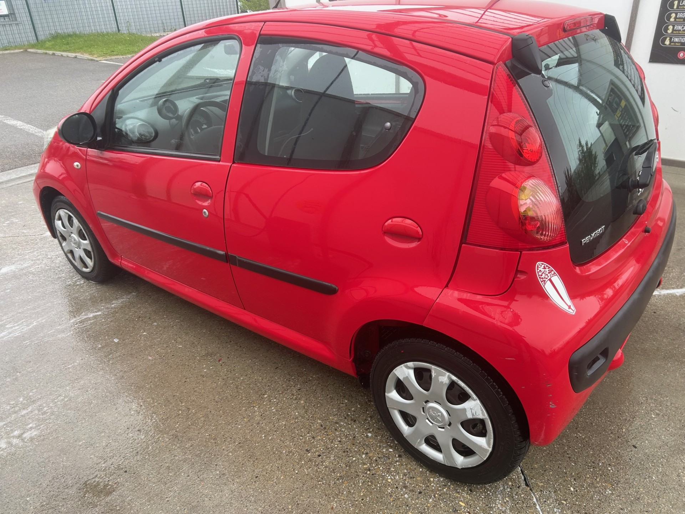
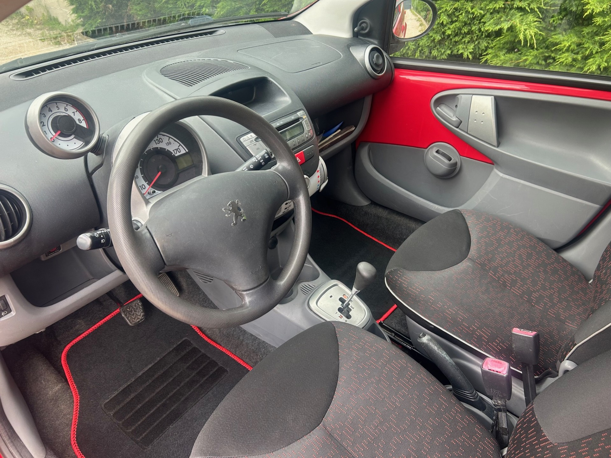

+++
title = "PEUGEOT 107 5p Boite auto rouge Essence 2010"
description = "PEUGEOT 107 5p Boite auto rouge Essence 2010"
tags = [
]
date = "2025-05-02"
categories = [
    "Voitures"
]
image = "../post/20250502_peugeot_107rouge_bva_2010_5p_146mkm/images/1.jpg"
adate = "2010"
akm = "146 000km"
agaz = "essence"
aboite = "auto"
apuissance= "68 CV"
acouleur = "rouge"
prix="5500"

+++

# PEUGEOT 107 5p BVA rouge Essence 2010 


 

PEUGEOT 107 5p BVA rouge Essence 2010  affichant 146.000 km 

### EQUIPEMENTS :
Boite de Vitesse Automatique, Direction assistée ,verrouillage centralisé, compte tours, Radio CD (possibilité de monter un autoradio récent avec écran tactile et fonction CARPLAY), vitres avant électriques, airbags, sièges arrières ISOFIX, banquette arrière rabattable, véritable roue de secours etc.
Liste d'options à valider avec moi lors de votre visite

### CARROSSERIE :
Très propre ( vernis un peu écaillé sur capot et toit)

### INTERIEUR :
Tissu noir ok

### MECANIQUE :
Entretien à jour ( vidange + filtres faits en 04/2024)
Moteur à chaîne ( pas de Courroie de distribution)
Embrayage neuf

Double des clés
Consommation : 4L/100km
Véhicule économe
Crit air 2
Contrôle technique OK 

Aucun frais à prévoir

### PRIX : 5500 Euros

Disponible rapidement
Garantie

<!-- more -->

