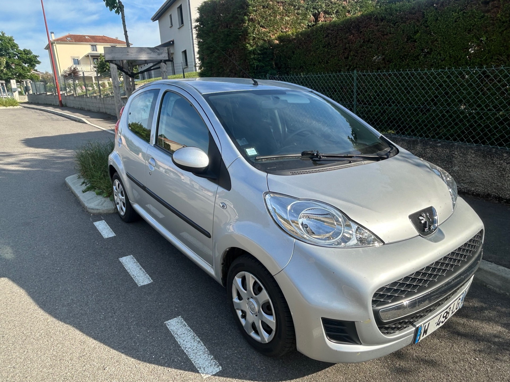
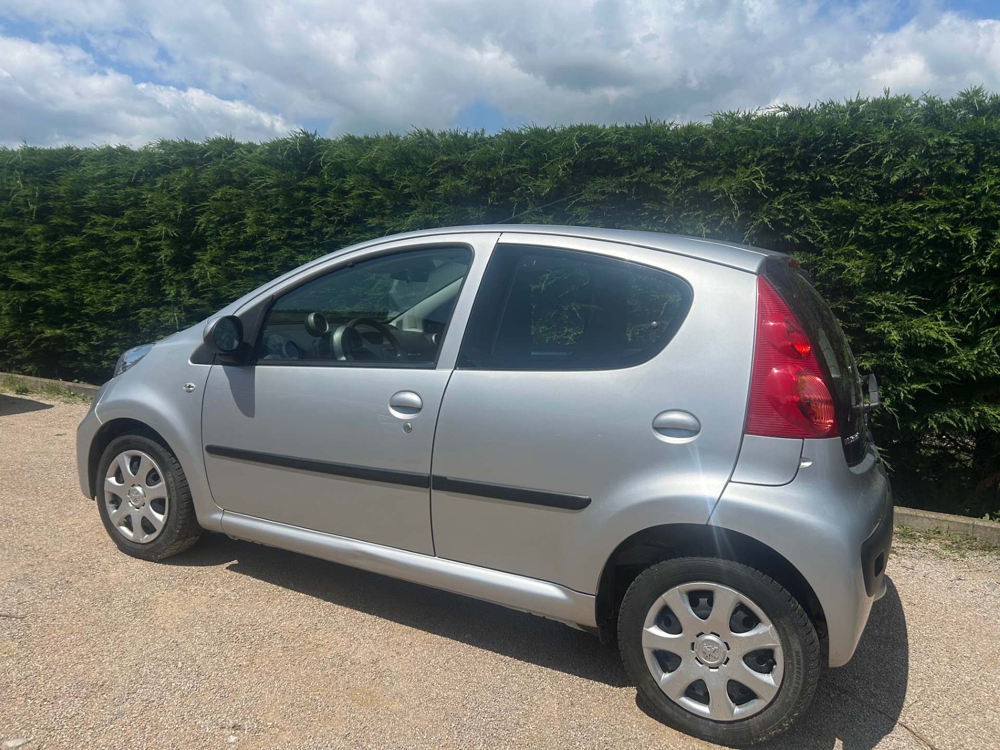
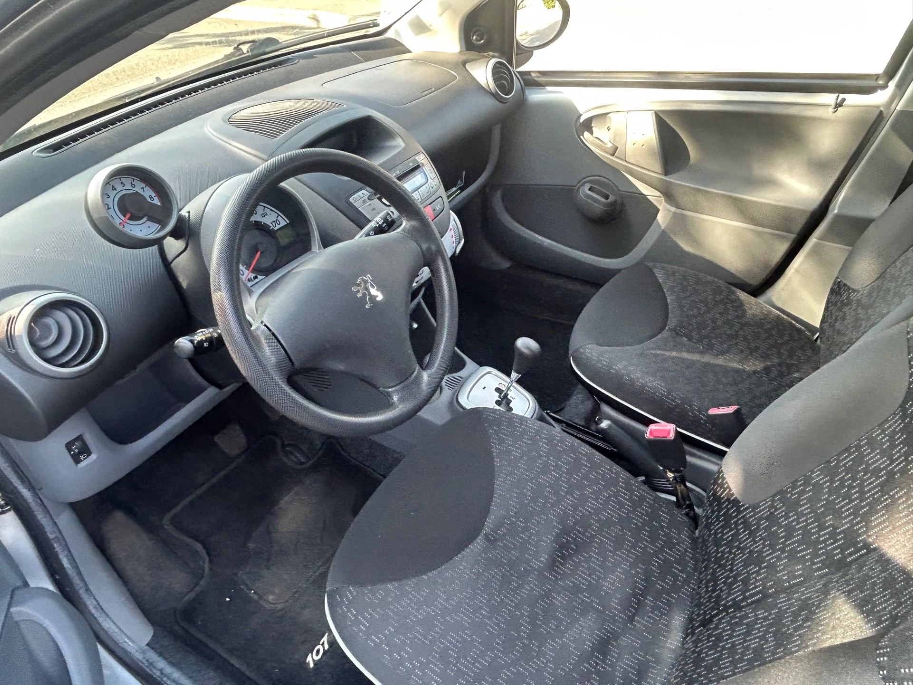

+++
title = "PEUGEOT 107 5p BVA grise Essence"
description = "PEUGEOT 107 5p BVA grise Essence"
tags = [
]
date = "2025-05-20"
categories = [
    "Voitures"
]
image = "../post/20250520_peugeot_107grise_bva_2009_5p_41mkm/images/1.jpg"
adate = "2009"
akm = "41 000km"
agaz = "essence"
aboite = "auto"
apuissance= "68 CV"
acouleur = "grise"
prix="7500"

+++

# PEUGEOT 107 5p BVA grise Essence


 

PEUGEOT 107 5p BVA grise Essence  affichant seulement 41.000 km 

### EQUIPEMENTS :
Boite de Vitesse Automatique, Direction assistée ,verrouillage centralisé, compte tours, Radio CD (possibilité de monter un autoradio récent avec écran tactile et fonction CARPLAY), vitres avant électriques, airbags, sièges arrières ISOFIX, banquette arrière rabattable, véritable roue de secours etc.
Liste d'options à valider avec moi lors de votre visite

### CARROSSERIE :
Très propre

### INTERIEUR :
Tissu noir ok

### MECANIQUE :
Entretien à jour ( vidange + filtres faits en 04/2024)
Moteur à chaîne ( pas de Courroie de distribution)

Double des clés
Consommation : 4L/100km
Véhicule économe
Crit air 2
Contrôle technique OK 

Ideal jeune permis en boite AUTO

Aucun frais à prévoir

### PRIX : 7500 Euros

Disponible rapidement
Garantie 6 mois

<!-- more -->

