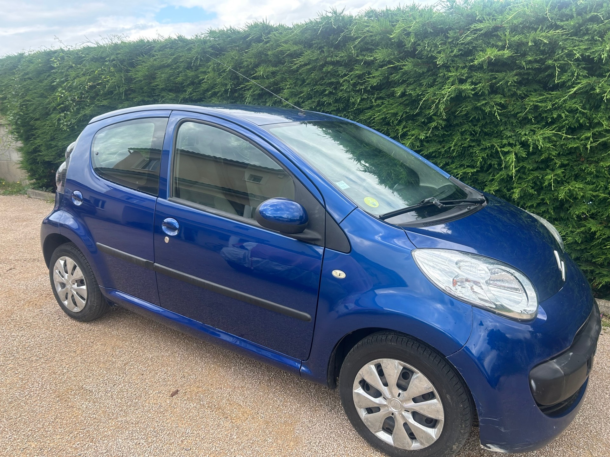
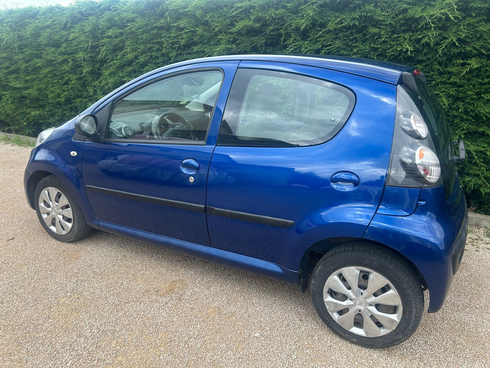
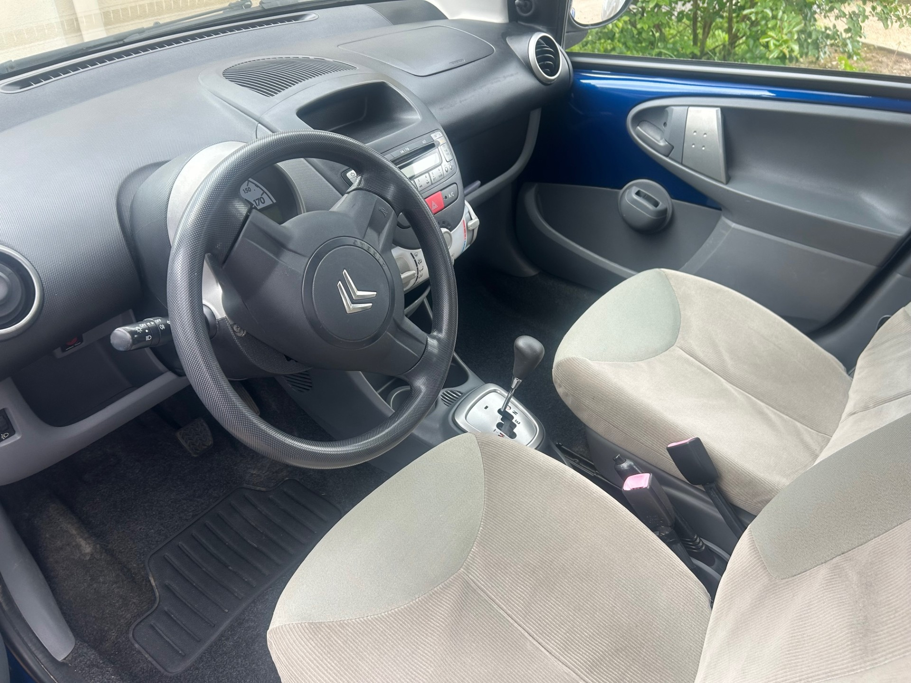

+++
title = "CITROEN C1 bleue BVA 5p bleue Essence"
description = "CITROEN C1 bleue BVA 5p bleue Essence"
tags = [
]
date = "2025-06-10"
categories = [
    "Voitures"
]
image = "../post/20250610_citroen_c1_bleue_bva_2007_5p_116mkm/images/1.jpg"
adate = "2007"
akm = "116 000km"
agaz = "essence"
aboite = "auto"
apuissance= "68 CV"
acouleur = "bleue"
prix="5900"

+++

# CITROEN C1 bleue BVA 5p bleue Essence


 

CITROEN C1 bleue BVA 5p bleue Essence  affichant 116.000 km 

### EQUIPEMENTS :
Boite de Vitesse Automatique, Direction assistée ,climatisation manuelle, verrouillage centralisé, compte tours, Radio CD (possibilité de monter un autoradio récent avec écran tactile et fonction CARPLAY), vitres avant électriques, airbags, sièges arrières ISOFIX, banquette arrière rabattable, véritable roue de secours etc.
Liste d'options à valider avec moi lors de votre visite

### CARROSSERIE 
propre

### INTERIEUR :
Tissu beige ok

### MECANIQUE :
Entretien à jour ( vidange + filtres faits en 04/2025)
Moteur à chaîne ( pas de Courroie de distribution)
Embrayage récent

Double des clés
Consommation : 4L/100km
Véhicule économe
Crit air 2
Contrôle technique OK 

Ideal jeune permis en boite AUTO

Aucun frais à prévoir

### PRIX : 5900 Euros

Disponible rapidement
Garantie 6 mois

<!-- more -->

