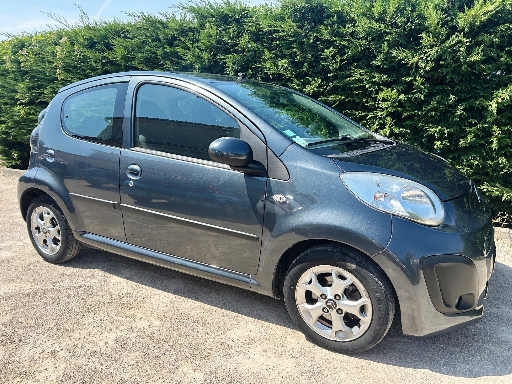
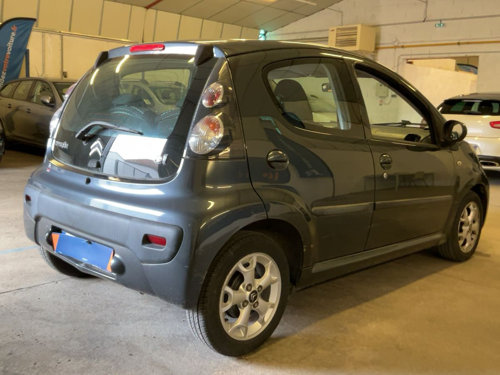
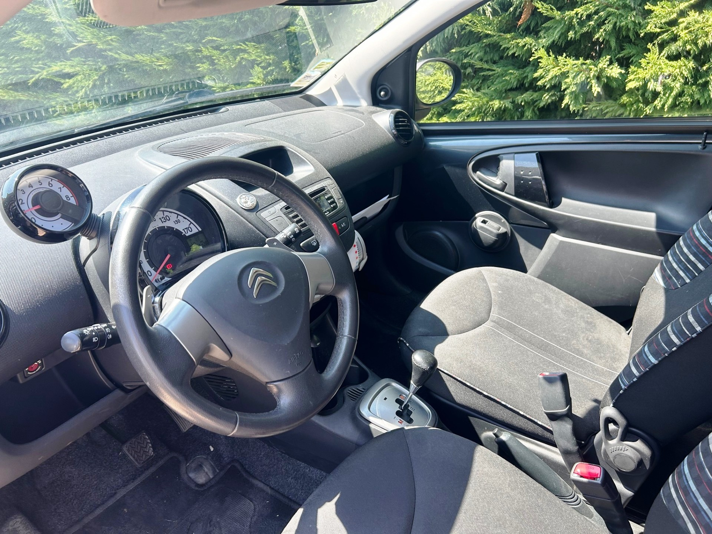

+++
title = "CITROEN C1 noire Boite AUTO 5 portes Essence clim"
description = "CITROEN C1 noire Boite AUTO 5 portes Essence clim"
tags = [
]
date = "2025-08-05"
categories = [
    "Voitures"
]
image = "../post/20250805_citroen_c1_noire_bva_2014_5p_46mkm/images/1.jpg"
adate = "2014"
akm = "46 000km"
agaz = "essence"
aboite = "auto"
apuissance= "68 CV"
acouleur = "noire"
prix="7600"

+++

# CITROEN C1 noire Boite AUTO 5 portes Essence clim


 

CITROEN C1 noire Boite AUTO 5 portes Essence clim affichant seulement 46.000 km 

### EQUIPEMENTS :
Boite de Vitesse Automatique, Direction assistée, climatisation manuelle, verrouillage centralisé, compte tours, Radio CD (possibilité de monter un autoradio récent avec écran tactile et fonction CARPLAY), vitres avant électriques, airbags, sièges arrières ISOFIX, banquette arrière rabattable, véritable roue de secours etc.
Liste d'options à valider avec moi lors de votre visite

### CARROSSERIE 
propre ( qq rayures d'usage)

### INTERIEUR :
Tissu noir ok

### MECANIQUE :
Entretien à jour ( vidange + filtres faits en 08/2025)
Moteur à chaîne ( pas de Courroie de distribution)

Double des clés
Consommation : 4L/100km
Véhicule économe
Crit air 1
Contrôle technique OK 

Ideal jeune permis en boite AUTO

Aucun frais à prévoir

### PRIX :7600 Euros

Disponible rapidement
Garantie 6 mois

<!-- more -->

