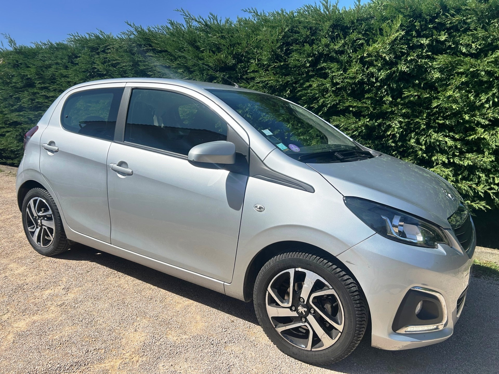
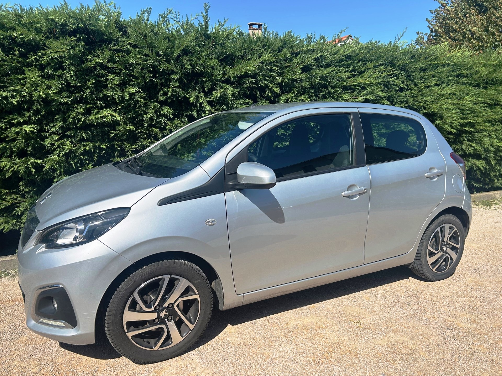
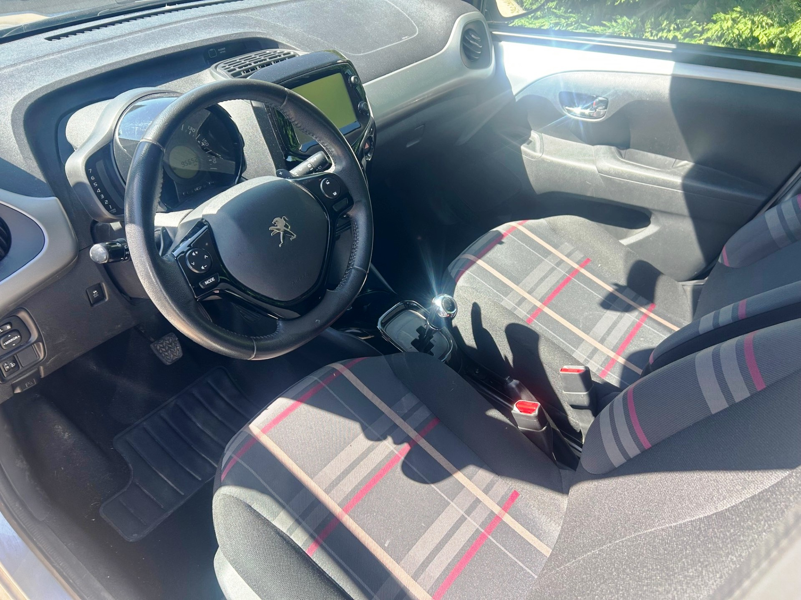

+++
title = "PEUGEOT 108 ALLURE Essence 68CV grise BVA 5p clim Crit'Air 1"
description = "PEUGEOT 108 ALLURE Essence 68CV grise BVA 5p clim Crit'Air 1"
tags = [
]
date = "2025-09-10"
categories = [
    "Voitures",
]
image = "../post/20250910_peugeot_108_bva_grise_2015_95mkm/images/1.jpg"
adate = "2015"
akm = "95 000km"
agaz = "essence"
aboite = "AUTO"

apuissance= "68 CV"
acouleur = "grise"
prix="9700"

+++

# PEUGEOT 108 ALLURE Essence 68CV grise BVA 5p clim Crit'Air 1



PEUGEOT 108 ALLURE Essence 68CV grise BVA 5p clim Crit'Air 1 affichant 95.000 km

### EQUIPEMENTS :
Verrouillage centralisé avec télécommande, vitres av électriques, Radio Bluetooth avec ecran tactile, camera de recul, climatisation manuelle, ABS, airbags, sièges arrières ISOFIX, banquette arrière rabattable, limiteur de vitesse, double des clés, véritable roue de secours, etc..

Liste d'options à valider avec un commercial lors de votre visite.

### CARROSSERIE :
Très bel état

### INTERIEUR :
Tissu noir très propre

### MECANIQUE :
Entretien à jour
Distribution par chaîne
Carnet tamponné PEUGEOT
Première main

Voiture disponible rapidement

### PRIX : 9700 Euros

<!-- more -->

