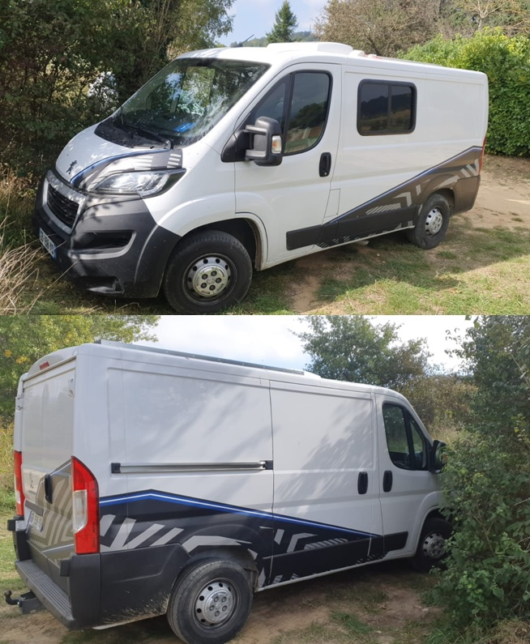
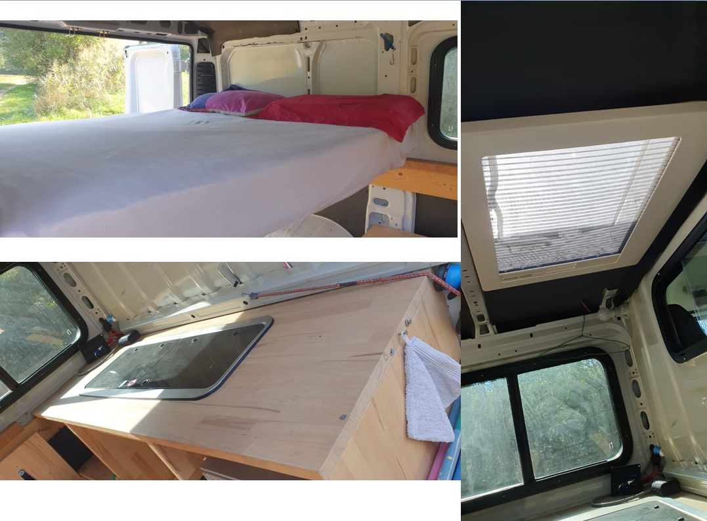
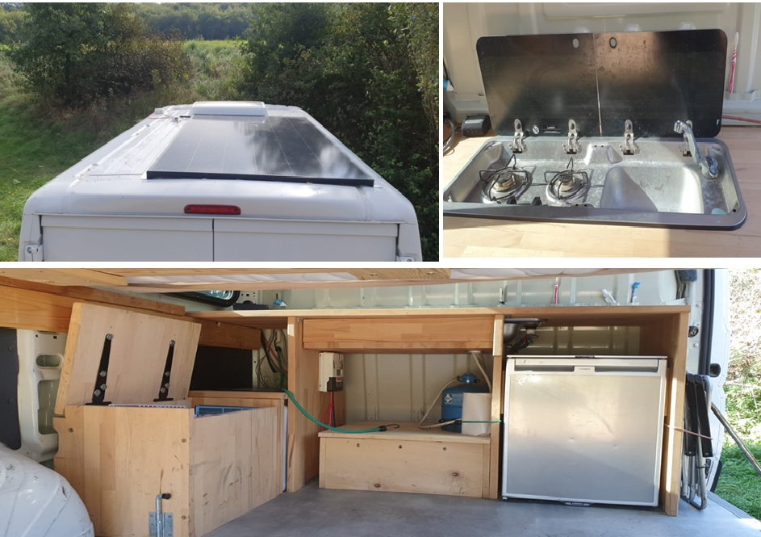

+++
title = "PEUGEOT BOXER 2.3L hdi 165cv L1H1 amenagé "
description = "PEUGEOT BOXER 2.3L hdi 165cv L1H1 amenagé"
tags = [
]
date = "2025-10-12"
categories = [
    "Voitures",
]
image = "../post/20251012_camion_greg/images/1.jpg"
adate = "2021"
akm = "77 000km"
agaz = "diesel"
aboite = "Manuelle"

apuissance= "165 CV"
acouleur = "blanche"
prix="19000"

+++

# PEUGEOT BOXER 2.3L hdi 165cv L1H1 amenagé



PEUGEOT BOXER 2.3L hdi 165cv L1H1 aménagé affichant seulement 77.000 km

### EQUIPEMENTS :
Panneau solaire 450W,régulateur de charge, 2 batteries à décharge lente 2x280Ah, cuve à eau 77l + pompe, Evier + réchaud intégré, frigo 12/24V 80L, lanterneau sur toiture, baie vitrée coulissante côté gauche, baie vitrée coulissante sur la séparation intérieure, plafond isolé Armaflex, etc..

Liste d'options à valider avec un commercial lors de votre visite.

### CARROSSERIE :
Très bel état 

### INTERIEUR :
Tissu noir très propre

### MECANIQUE :
Entretien à jour 
pneus avant neufs
suspension avant neuve

Voiture disponible début Octobre
Visible dans le 26 ( Drôme)

### PRIX :19000 Euros

<!-- more -->

