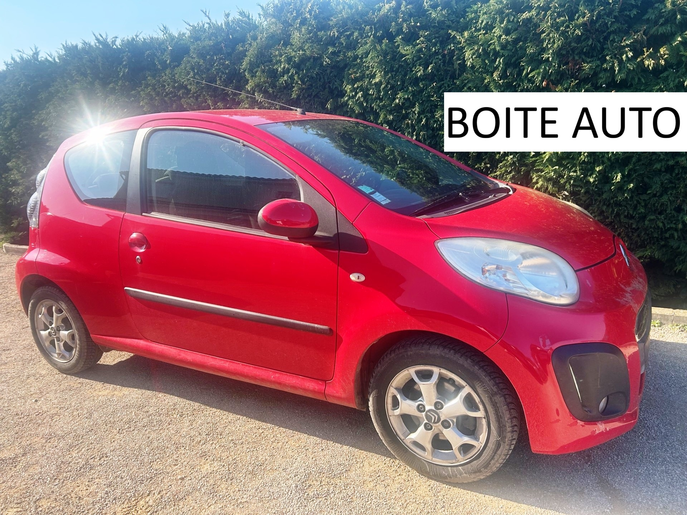
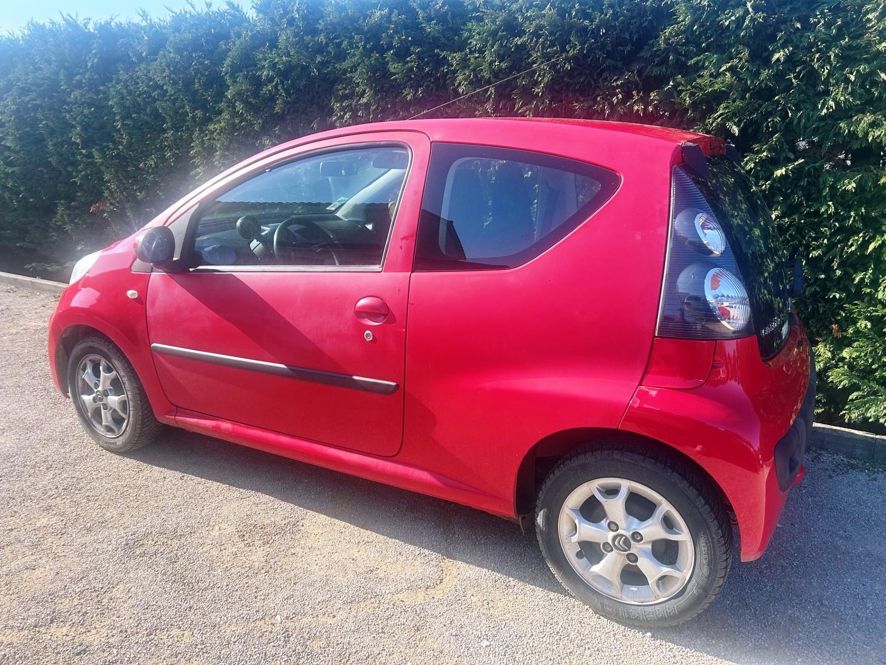
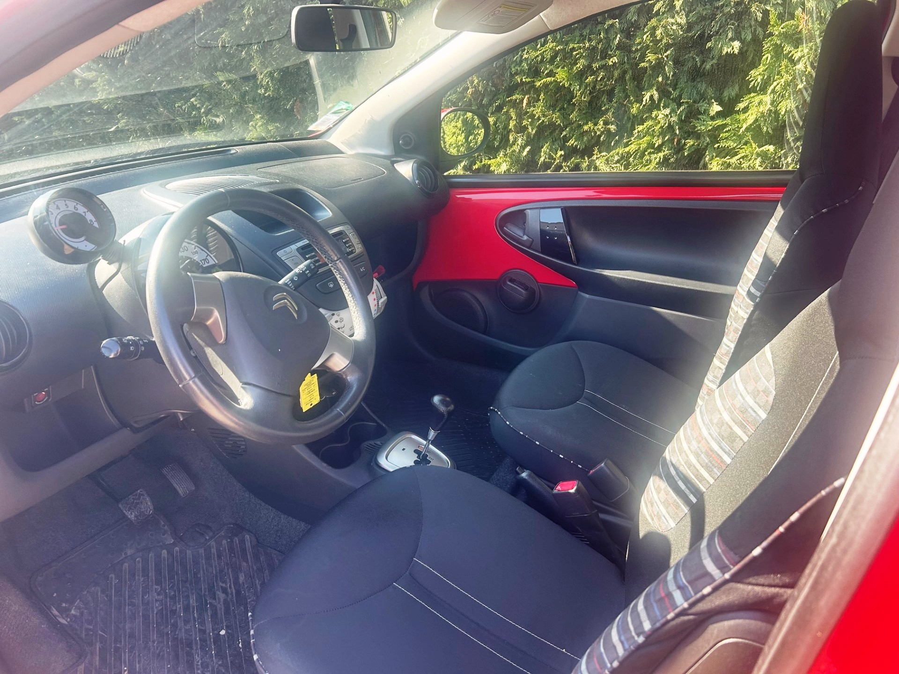

+++
title = "CITROEN C1 rouge BVA clim "
description = "CITROEN C1 rouge BVA clim  "
tags = [
]
date = "2026-02-28"
categories = [
    "Voitures"
]
image = "../post/20260228_citroen_c1_bva_2012_rouge_3p_146mkm/images/1.jpg"
adate = "2012"
akm = "146 000km"
agaz = "essence"
aboite = "auto"
apuissance= "68 CV"
acouleur = "rouge"
prix="6400"

+++

#CITROEN C1 rouge BVA clim


 

CITROEN C1 rouge BVA clim affichant 146.000 km

### EQUIPEMENTS :
Verrouillage centralisé avec télécommande, Compte tours, Direction assistée , Radio CD ( possibilité CARPLAY Bluetooth en option), Vitres avant électriques, Airbags, Sièges arrières ISOFIX, Banquette arrière rabattable, véritable roue de secours, etc..
Liste d'options à valider avec un commercial lors de votre visite

### CARROSSERIE :
Propre

### INTERIEUR :
Tissu très propre

### MECANIQUE :
Entretien à jour ( vidange + filtres fait en 02/26)
Moteur à chaîne ( pas de Courroie de distribution)
Historique d'entretien

Double des clés
Consommation : 4L/100km
Véhicule économe

Contrôle technique OK 

Aucun frais à prévoir

### PRIX : 6400 Euros

Disponible rapidement
Garantie 6 mois

<!-- more -->

