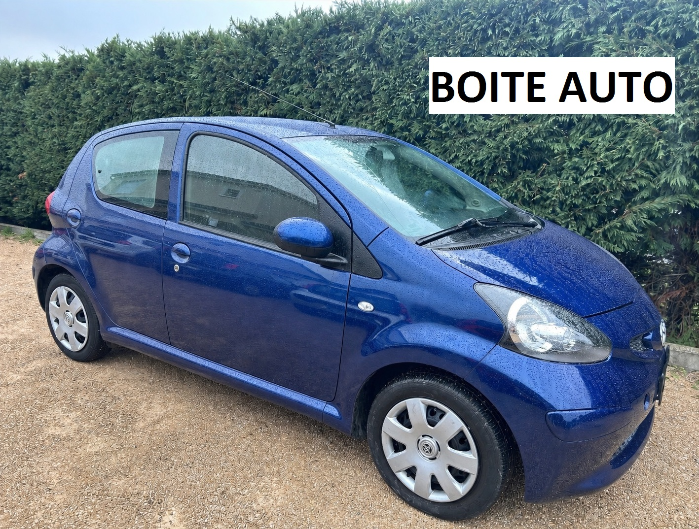
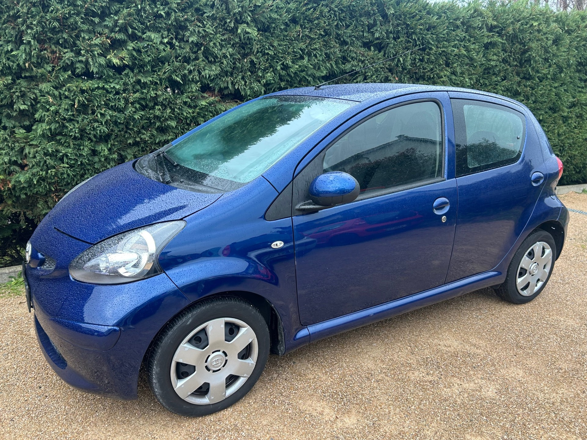
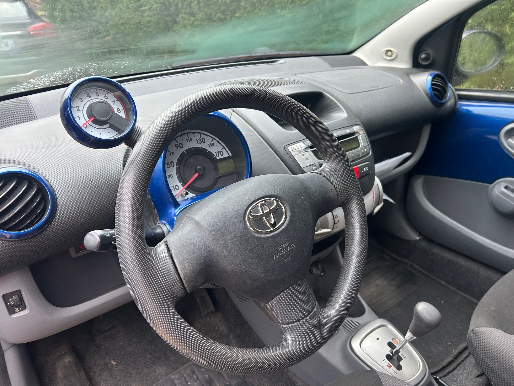

+++
title = "TOYOTA AYGO bleue Essence 5p BVA clim "
description = "TOYOTA AYGO bleue Essence 5p BVA clim "
tags = [
]
date = "2026-03-11"
categories = [
    "Voitures"
]
image = "../post/20260311_toyota_aygobva_2008_bleue_119mkm/images/1.jpg"
adate = "2008"
akm = "119 000km"
agaz = "essence"
aboite = "auto"
apuissance= "68 CV"
acouleur = "bleue"
prix="7100"

+++

# TOYOTA AYGO bleue Essence 5p BVA clim


 

TOYOTA AYGO bleue Essence 5p BVA clim affichant 119.000 km

### EQUIPEMENTS :
Climatisation, Verrouillage centralisé avec télécommande, Compte tours, Direction assistée , Radio CD  (CARPLAY Bluetooth en option), Vitres avant électriques, Airbags, Sièges arrières ISOFIX, Banquette arrière rabattable, etc..
Liste d'options à valider avec un commercial lors de votre visite

### CARROSSERIE :
Propre

### INTERIEUR :
Tissu très propre

### MECANIQUE :
Entretien à jour ( vidange + filtres fait en 02/25)
Moteur à chaîne ( pas de Courroie de distribution)

Double des clés
Consommation : 4L/100km
Véhicule économe

Contrôle technique OK 

Aucun frais à prévoir

### PRIX : 7100 Euros

Disponible sous 3 semaines
Garantie 6 mois

<!-- more -->

