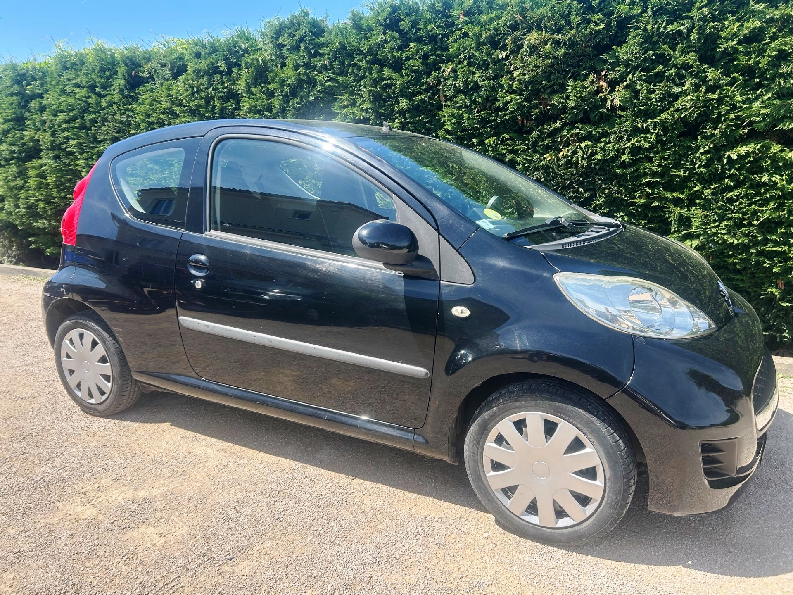
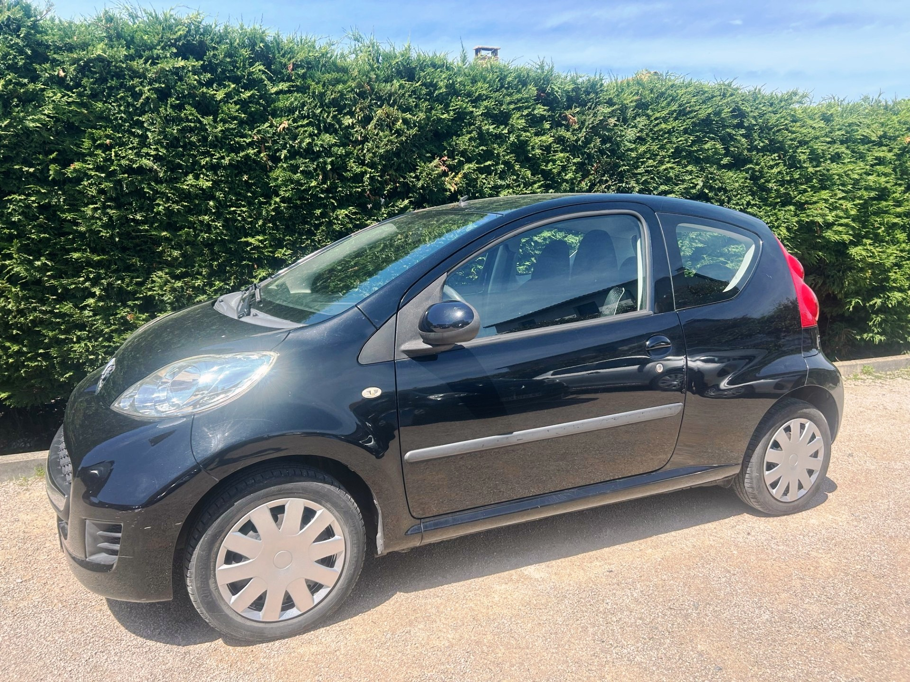
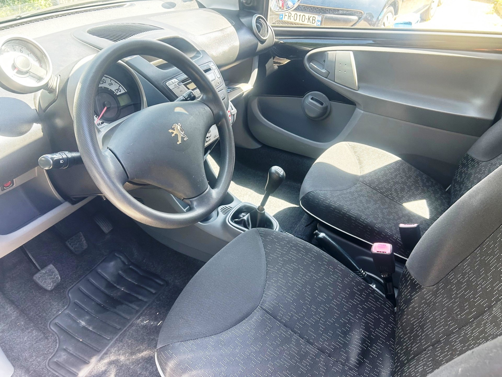

+++
title = "PEUGEOT 107 2010 noire 68CH Blue Lion Trendy "
description = "PEUGEOT 107 2010 noire 68CH Blue Lion Trendy   "
tags = [
]
date = "2026-05-10"
categories = [
    "Voitures"
]
image = "../post/20260510_peugeot_107bm5_2010_noir_3p_111mkm/images/1.jpg"
adate = "2010"
akm = "111 000km"
agaz = "essence"
aboite = "manu"
apuissance= "68 CV"
acouleur = "noire"
prix="4900"

+++

# PEUGEOT 107 2010 noire 68CH Blue Lion Trendy 


 

PEUGEOT 107 2010 noire 68CH Blue Lion Trendy affichant 111.000km

### EQUIPEMENTS :
Climatisation, Verrouillage centralisé avec télécommande, Compte tours, Direction assistée , CARPLAY Bluetooth, Vitres avant électriques, Airbags, Sièges arrières ISOFIX, Banquette arrière rabattable, etc..
Liste d'options à valider avec un commercial lors de votre visite

### CARROSSERIE :
Propre ( qq rayures et traces d'usage)

### INTERIEUR :
Tissu très propre 

### MECANIQUE :
Entretien à jour ( vidange + filtres fait en 04/26)

Moteur à chaîne ( pas de Courroie de distribution)

Double des clés

Consommation : 4L/100km

Véhicule économe

Contrôle technique OK 

Aucun frais à prévoir

Disponible sur parc

### PRIX : 4900 Euros

Disponible rapidement
Garantie 6 mois

<!-- more -->

