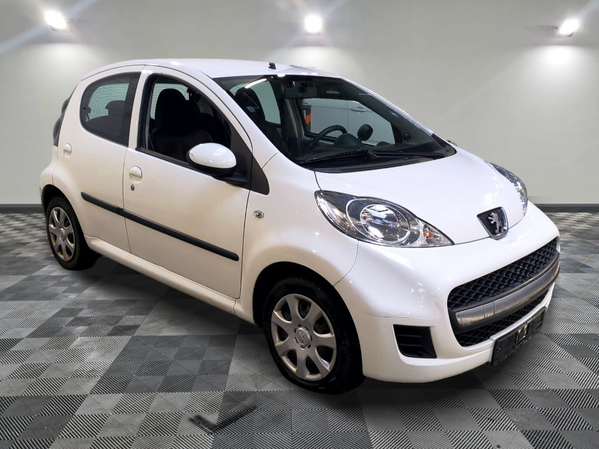
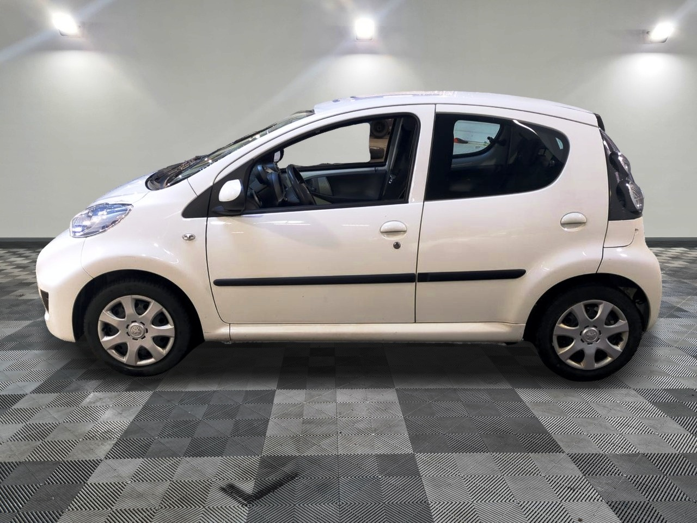
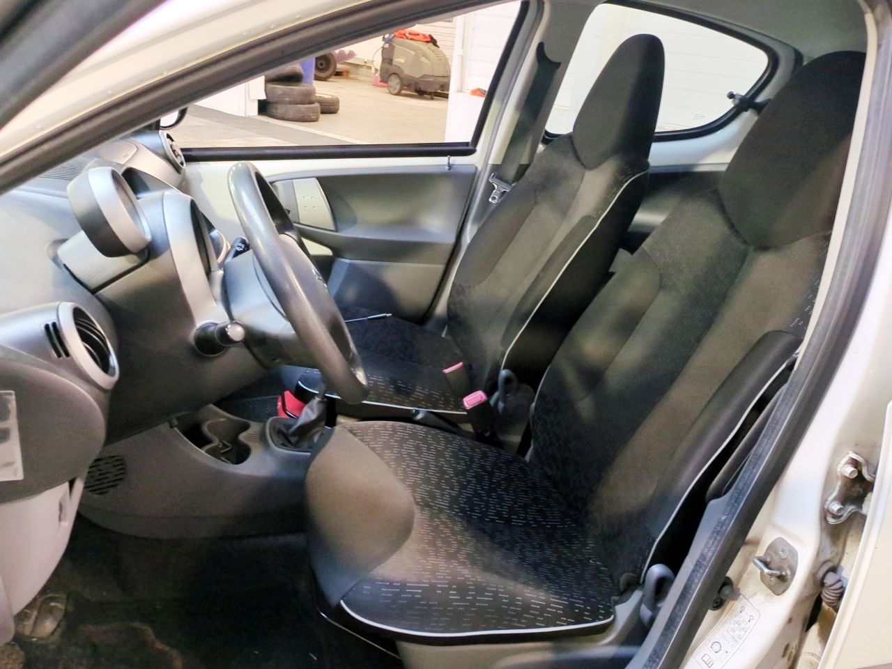

+++
title = "PEUGEOT 107 blanche 68CH Blue Lion Trendy "
description = "PEUGEOT 107 blanche 68CH Blue Lion Trendy  "
tags = [
]
date = "2026-05-20"
categories = [
    "Voitures"
]
image = "../post/20260520_peugeot_107bm5_2009_blanche_5p_132mkm_lux/images/1.jpg"
adate = "2009"
akm = "132 000km"
agaz = "essence"
aboite = "manu"
apuissance= "68 CV"
acouleur = "blanche"
prix="4200"

+++

# PEUGEOT 107 blanche 68CH Blue Lion Trendy 


 

PEUGEOT 107 blanche 68CH Blue Lion Trendy affichant 132.000km

### EQUIPEMENTS :
 Verrouillage centralisé avec télécommande, Compte tours, Direction assistée , CARPLAY Bluetooth, Vitres avant électriques, Airbags, Sièges arrières ISOFIX, Banquette arrière rabattable, etc..
Liste d'options à valider avec un commercial lors de votre visite

### CARROSSERIE :
Très Propre

### INTERIEUR :
Tissu très propre 

### MECANIQUE :
Entretien à jour ( vidange + filtres fait en 04/26)

Moteur à chaîne ( pas de Courroie de distribution)

Double des clés

Consommation : 4L/100km

Véhicule économe

Contrôle technique OK 

Aucun frais à prévoir

Disponible sur parc

### PRIX : 4200 Euros

Disponible rapidement
Garantie 6 mois

<!-- more -->

