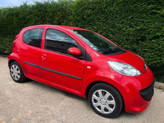
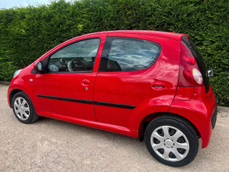
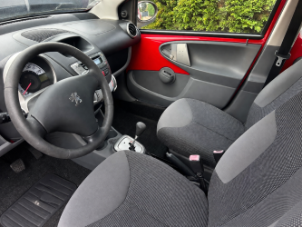

+++
title = "PEUGEOT 107 2008 rouge 5p BVA clim "
description = "PEUGEOT 107 2008 rouge 5p BVA clim "
tags = [
]
date = "2026-07-25"
categories = [
    "Voitures"
] 
image = "../post/20260725_peugeot_107bva_2009_rouge_5p_166mkm_dordogne/images/1.jpg"
adate = "2008"
akm = "166 000km"
agaz = "essence"
aboite = "auto"
apuissance= "68 CV"
acouleur = "rouge"
prix="5800"

+++

# PEUGEOT 107 2008 rouge 5p BVA clim 


 

PEUGEOT 107 2008 rouge 5p BVA clim affichant 166.000 km

### EQUIPEMENTS :
Climatisation, Verrouillage centralisé avec télécommande, Compte tours, Direction assistée , Radio CD ( possibilité de CARPLAY Bluetooth en option), Vitres avant électriques, Airbags, Sièges arrières ISOFIX, Banquette arrière rabattable, etc..
Liste d'options à valider avec un commercial lors de votre visite

### CARROSSERIE :
Bel état général

### INTERIEUR :
Tissu très propre

### MECANIQUE :
Entretien à jour ( vidange + filtres fait en 06/26)
Moteur à chaîne ( pas de Courroie de distribution)
Embrayage neuf

Double des clés
Consommation : 4L/100km
Véhicule économe

Contrôle technique OK 

Aucun frais à prévoir

### PRIX : 5800 Euros

Disponible rapidement
Garantie 6 mois

<!-- more -->

