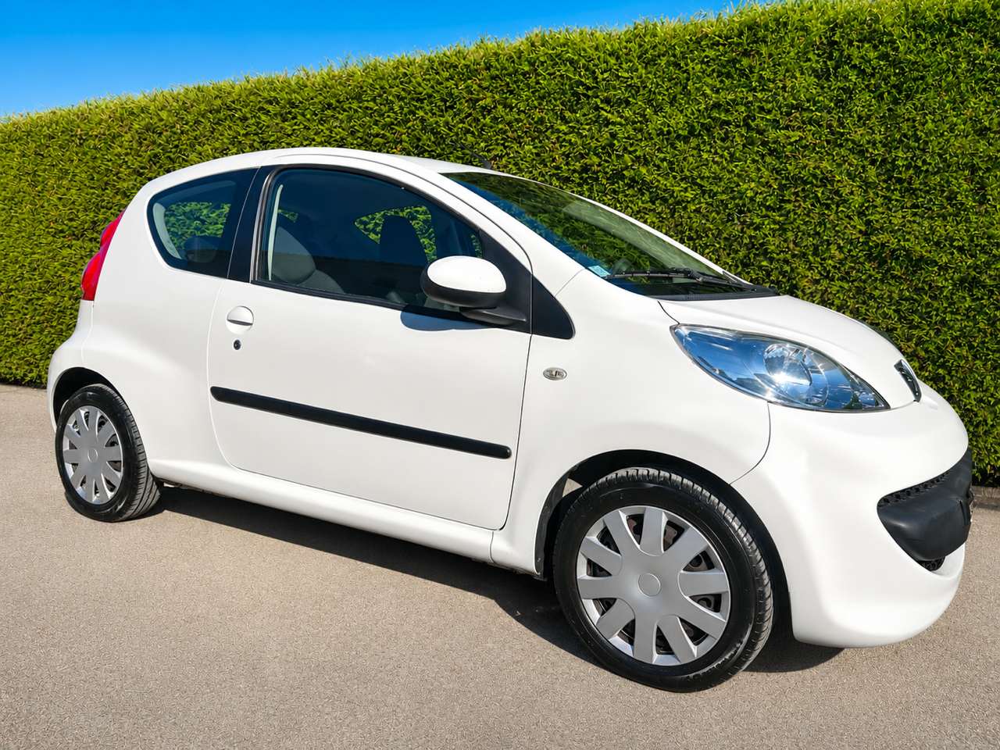
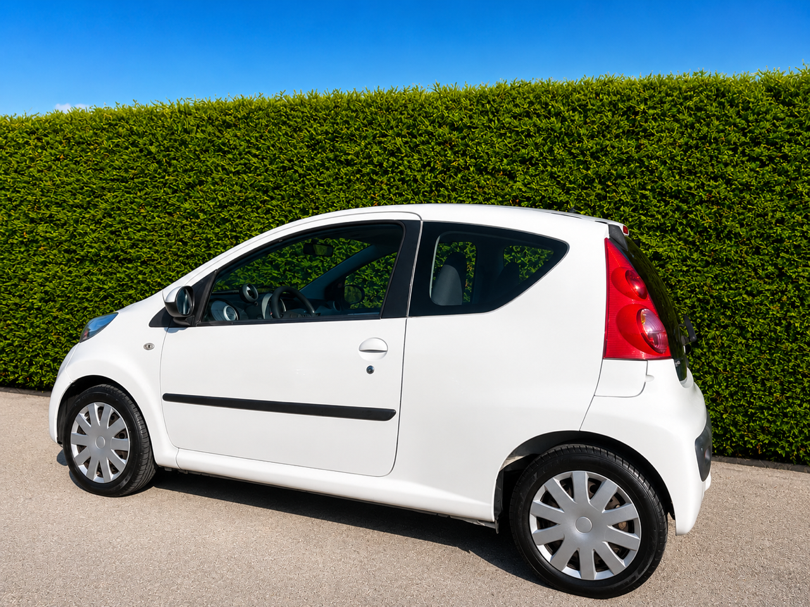
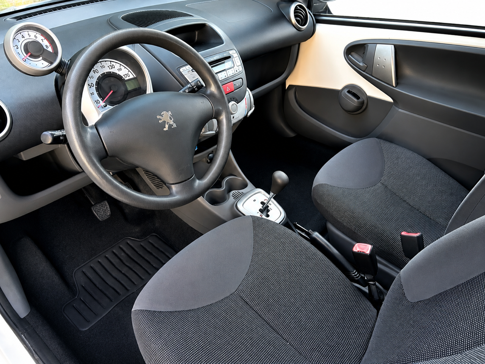

+++
title = "PEUGEOT 107 blanch3 5p BVA clim"
description = "PEUGEOT 107 blanch3 5p BVA clim "
tags = [
]
date = "2026-08-07"
categories = [
    "Voitures"
]
image = "../post/20260807_peugeot_107bva_2007_blanche_99mkm/images/1.jpg"
adate = "2007"
akm = "99 000km"
agaz = "essence"
aboite = "auto"
apuissance= "68 CV"
acouleur = "blanche"
prix="6300"

+++

# PEUGEOT 107 blanch3 5p BVA clim


 

PEUGEOT 107 blanch3 5p BVA clim affichant 99.000 km

### EQUIPEMENTS :
Verrouillage centralisé avec télécommande, Compte tours, Direction assistée , Radio CD ( CARPLAY Bluetooth possible en option), Vitres avant électriques, Airbags, Sièges arrières ISOFIX, Banquette arrière rabattable, véritable roue de secours etc..
Liste d'options à valider avec un commercial lors de votre visite

### CARROSSERIE :
Très bel état général

### INTERIEUR :
Tissu très propre

### MECANIQUE :
Entretien à jour ( vidange + filtres )
Moteur à chaîne ( pas de Courroie de distribution)
Historique d'entretien
Embrayage récent
pompe à eau neuve

Double des clés
Consommation : 4L/100km
Véhicule économe

Contrôle technique OK 

Aucun frais à prévoir

### PRIX : 6300 Euros

Disponible rapidement
Garantie 6 mois

<!-- more -->

