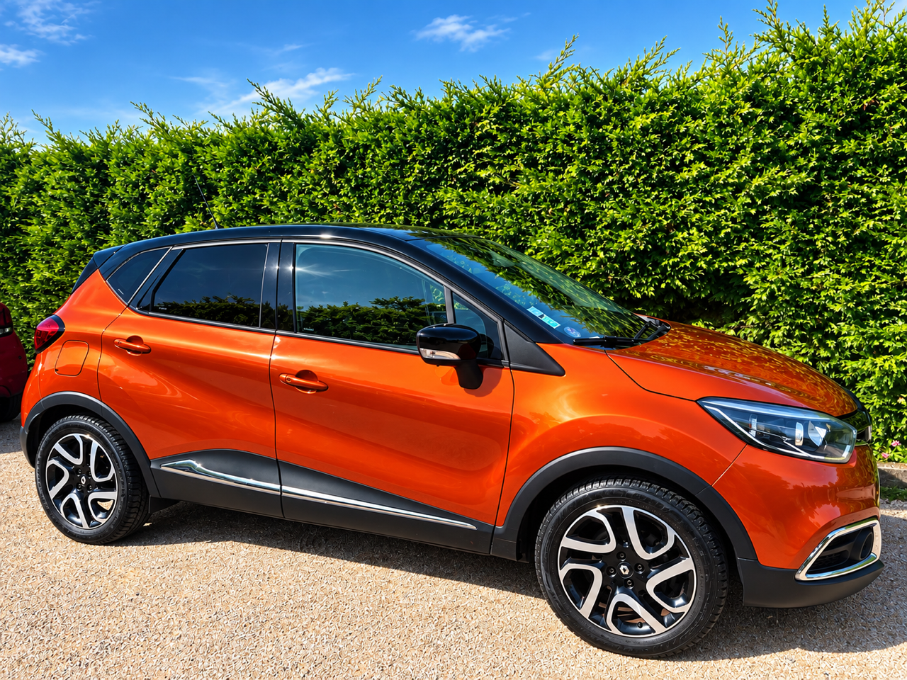
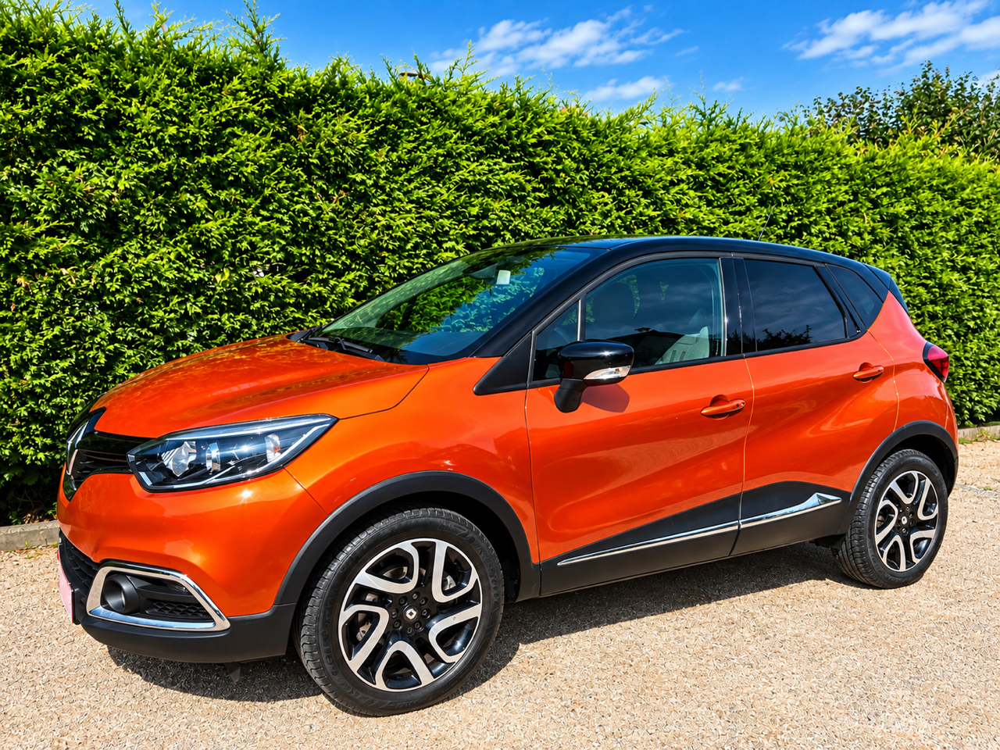
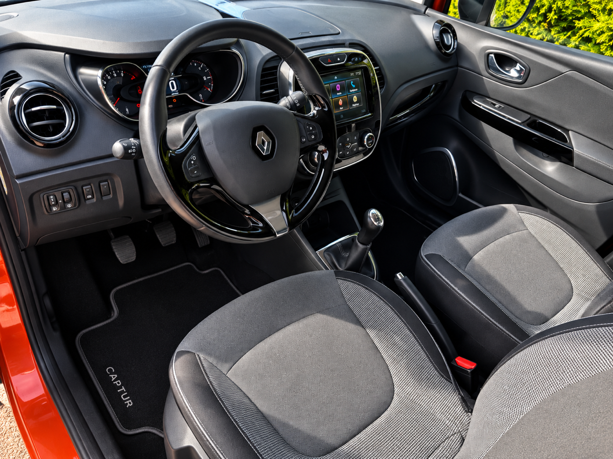

+++
title = "RENAULT CAPTUR 0.9TCE 90CV ENERGY LIFE "
description = "RENAULT CAPTUR 0.9TCE 90CV ENERGY LIFE"
tags = [
]
date = "2026-10-02"
categories = [
    "Voitures"
]
image = "../post/20261003_renault_catur_2014_orange_5p_125mkm/images/1.jpg"
adate = "2014"
akm = "125 000km"
agaz = "essence"
aboite = "manu"
apuissance= "90 CV"
acouleur = "orange"
prix="7200"

+++

#  RENAULT CAPTUR 0.9TCE 90CV ENERGY LIFE


 

RENAULT CAPTUR 0.9TCE 90CV ENERGY LIFE affichant 125.000km

### EQUIPEMENTS :
Verrouillage centralisé avec télécommande, Compte tours, Direction assistée , Poste Radio Bluetooth avec écran tactile, Vitres avant électriques, Airbags, Sièges arrières ISOFIX, Banquette arrière rabattable, climatisation, etc..
Liste d'options à valider avec un commercial lors de votre visite

### CARROSSERIE :
Très bel état

### INTERIEUR :
Tissu très propre 

### MECANIQUE :
Entretien à jour ( vidange + filtres fait en 09/26)

Moteur à chaîne ( pas de Courroie de distribution)

Double des clés 

Aucun frais à prévoir

Disponible sur parc

### PRIX : 7200 Euros

Garantie 6 mois

<!-- more -->

